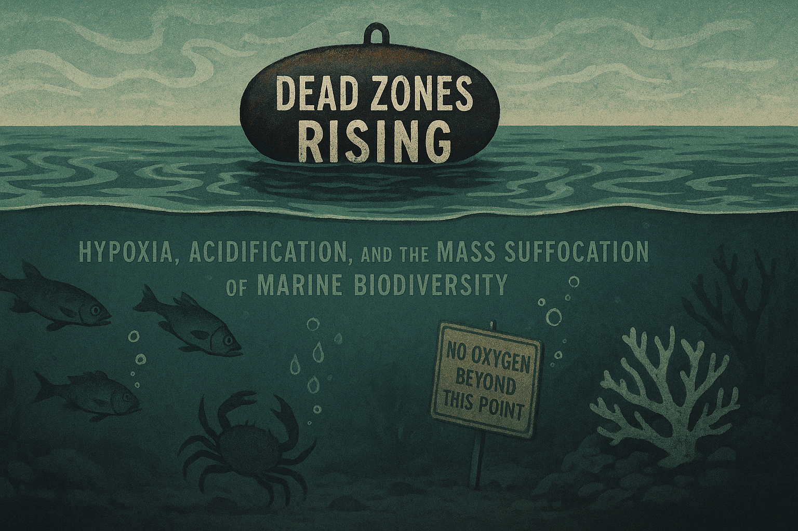

# Dead Zones Rising

## Hypoxia, Acidification, and the Mass Suffocation of Marine Biodiversity

---

There is a sign at the bottom of the ocean. It reads: *No Oxygen Beyond This Point.*

It is, of course, a metaphor—except it isn't. Across more than seven hundred coastal waters worldwide, the sign might as well be posted in rusting iron, barnacle-crusted and forgotten, marking the boundary where life simply stops. The ocean that covers seventy-one percent of our planet, that holds ninety-seven percent of all water, that birthed every ancestor we have ever had—this ocean is suffocating. Not drowning. Suffocating. The distinction matters. Drowning implies an external force, something that happened to the victim. Suffocation is slower. Suffocation is what happens when the very medium of survival turns hostile, when the water itself becomes a tomb.

Since pre-industrial times, the ocean's pH has fallen by 0.1 units. That number sounds small. It represents a thirty percent increase in acidity. The ocean is now more acidic than it has been in three hundred million years—before the dinosaurs, before the first forests, before anything we would recognize as familiar walked or swam or flew. And most of humanity has no idea.

---

## The Anatomy of Suffocation

The process that creates a dead zone follows a grim choreography, as predictable as it is ignored.

It begins in the fields. Nitrogen and phosphorus—the lifeblood of modern agriculture—pour from farmland in quantities that would have seemed obscene to farmers a century ago. In 1960, the world applied ten million tons of synthetic nitrogen fertilizer. By 2020, that figure had grown to more than one hundred and ten million tons. Crops absorb perhaps half of what we give them. The rest runs. It runs through topsoil and drainage ditches, through creeks and tributaries, down rivers that remember nothing of the chemicals they carry, until finally it reaches the coast. There, the nutrients do exactly what nutrients do: they feed things.

The algae bloom first. Phytoplankton populations explode in green clouds that can be seen from space, sometimes tinged red in what fishermen have long called "red tides" but what scientists now term harmful algal blooms. The water turns opaque with life—too much life, the wrong kind of life, life that has no predator because the system was never designed for this much of anything.

Then the algae die. They always die. Their lifespans are measured in days, and when they go, they sink. Billions upon billions of microscopic corpses drift downward through the water column, and at the bottom, the bacteria are waiting. Decomposition is hungry work. The bacteria consume oxygen as they break down the dead, and in coastal waters where warm surface layers trap cooler bottom waters beneath them, that oxygen cannot be replaced. The technical term is stratification. The practical term is a lid on a coffin.

When dissolved oxygen falls below two milligrams per liter, most marine life cannot survive. Fish that can swim will flee. Those that cannot—the mussels anchored to rocks, the corals cemented to substrate, the worms burrowed in sediment, the crabs too slow to outrun chemistry—will die where they stand. This is not a dramatic death. There is no thrashing, no visible struggle. The creatures simply stop, their metabolisms grinding to a halt as the water around them fails to provide the one thing they cannot live without.

The dead zone has arrived.

---

## A Geography of Absence

These zones of biological silence cluster where rivers meet seas, where the accumulated sins of continental agriculture finally reach their terminus.

In the Gulf of Mexico, the Mississippi River completes its two-thousand-mile journey carrying the runoff of thirty-one states—the fertilizer from Iowa cornfields, the hog waste from North Carolina lagoons, the lawn chemicals from suburban St. Louis. Each spring, as snowmelt swells the river's flow, roughly 1.7 million tons of nitrogen wash into the Gulf. By summer, a dead zone measuring anywhere from three thousand to eight thousand square miles has formed, a region larger than some states where shrimpers find empty nets and marine biologists find graveyards. The economic losses run to billions. The ecological losses cannot be calculated because we never finished counting what was there.

The Baltic Sea holds the distinction of hosting the world's largest human-caused dead zone—seventy thousand square kilometers of oxygen-depleted water, fed by agricultural and industrial pollution from nine surrounding nations. The problem has been growing since the 1950s, which means we have had seven decades of data, seven decades of warnings, seven decades of watching the zone expand while international committees met and dispersed and met again.

The Black Sea once contained the largest dead zone ever recorded, forty thousand square kilometers of lifeless water. Then the Soviet Union collapsed. Collective farms stopped buying fertilizer they could no longer afford. Within a decade, the dead zone began to shrink—proof, cold and irrefutable, that these systems can recover if we simply stop poisoning them. We learned this lesson. We have not applied it.

The list continues: Chesapeake Bay, East China Sea, Arabian Sea, Adriatic Sea, the Oregon coast. More than seven hundred dead zones now mark the world's coastal waters, a number that has doubled each decade since the 1960s. In the sixties, scientists counted roughly fifty. By the eighties, one hundred and fifty. By the 2000s, four hundred. Now, seven hundred and climbing. This is not natural variation. This is systematic poisoning administered over generations, with the poisoners fully aware of what they are doing.

---

## The Other CO₂ Problem

While dead zones spread across the coasts, another crisis unfolds in the open ocean—one that makes no distinction between coastlines and deep water, between tropics and poles. They call it the "evil twin" of climate change, and unlike its sibling, it proceeds almost entirely unnoticed.

The ocean has absorbed approximately thirty percent of all the carbon dioxide humanity has released since the Industrial Revolution. This absorption has prevented atmospheric warming from being even more catastrophic than it already is. The ocean has done us a service we did not ask for and cannot repay. The cost of that service is being paid in chemistry.

When carbon dioxide dissolves in seawater, it forms carbonic acid. The hydrogen ions released by this reaction lower the water's pH—they make it more acidic. But those hydrogen ions do something else as well: they bind with carbonate ions, the very molecules that shell-building organisms need to construct their calcium carbonate armor. Every ton of CO₂ the ocean absorbs means less carbonate available for the creatures that depend on it. The shells grow thinner. The shells grow weaker. In some waters, the shells have begun to dissolve.

Before the Industrial Revolution, the ocean's surface pH held steady at approximately 8.25. Today it stands at 8.14. The pH scale is logarithmic; that 0.11-unit drop represents a thirty percent increase in hydrogen ion concentration. By century's end, projections suggest the ocean could reach pH levels between 7.8 and 7.95—a one hundred to one hundred fifty percent increase in acidity, conditions not experienced on this planet since before the dinosaurs arose.

Consider the pteropods, the tiny "sea butterflies" that drift through polar and temperate waters. They are foundational to marine food webs—critical prey for salmon, herring, and whales. In Antarctic waters, researchers have found populations with shells already fifty percent dissolved, their protective coverings eaten away by water that has grown too acidic to sustain them. Consider the oyster hatcheries of the Pacific Northwest, where operators have documented eighty percent larval mortality in acidified conditions, an industry worth hundreds of millions of dollars watching its future dissolve in tanks. Consider the coral reefs, already hammered by warming waters, now facing the additional stress of acidification reducing their ability to calcify—the Great Barrier Reef has experienced five mass bleaching events since 2016 alone.

Consider the coccolithophores, microscopic algae that few people have heard of and fewer still could name. They produce tiny calcium carbonate plates and form the base of countless marine food chains. They also produce dimethyl sulfide, a compound that seeds cloud formation, linking the health of these invisible organisms to the weather patterns of entire continents. Their shell weight has declined five to ten percent over the industrial era. We are thinning the armor of creatures that regulate our climate, and most of us do not know their names.

---

## When Suffocation Meets Dissolution

Dead zones and ocean acidification are not separate crises. They are the same crisis viewed from different angles, and where they overlap, the mathematics of death become multiplicative rather than additive.

In waters depleted of oxygen, bacterial decomposition releases additional carbon dioxide, intensifying local acidification. The organisms trapped in these waters face a double assault: they cannot breathe, and the chemical environment is dissolving their bodies. Acidification impairs hemoglobin function, meaning creatures in low-oxygen water become even less efficient at extracting what little oxygen remains. Stress increases metabolic demand, which increases oxygen requirements precisely when supply has collapsed. Immune systems falter under multiple simultaneous pressures. Eggs and larvae—the most vulnerable life stages—fail at rates that researchers describe with words like "unprecedented" and "catastrophic."

Now add temperature. Warmer water holds less dissolved oxygen—roughly seven percent less for every degree Celsius of warming. Warmer surface waters are less dense, increasing stratification, reducing the vertical mixing that might otherwise replenish depleted bottom waters. Higher temperatures increase metabolic rates across the board, meaning organisms need more oxygen even as less becomes available. Climate change intensifies precipitation events, washing more nutrients into waterways during floods, creating larger and more persistent algal blooms.

The ocean is warming, acidifying, and losing oxygen simultaneously. Between two and five percent of the ocean's oxygen content has disappeared since 1960—some 245 billion metric tons of oxygen simply gone. Oxygen minimum zones have expanded by 4.5 million square kilometers over the same period. The deep ocean, far from the surface disruptions, is losing oxygen even faster than the waters above.

This is a triple assault on marine life. There is no evolutionary playbook for surviving all three at once.

---

## The Collapse in Numbers

The ocean is not merely stressed. It is emptying.

More than one-third of all assessed fish stocks are now overfished—harvested beyond the point of sustainable reproduction. Ninety percent of large predatory fish have vanished since 1950, the sharks and tuna and swordfish that once ruled their ecosystems reduced to remnant populations hiding in pockets the fleets have not yet found. Fisheries scientists call it "fishing down the food web"—as large species disappear, the industry targets smaller and smaller fish, working its way down the chain toward whatever is left.

The Living Planet Index for marine species shows a forty-nine percent decline since 1970. Freshwater species—the fish and amphibians of rivers and lakes—have fallen eighty-three percent, the steepest decline of any biome on Earth. Shark populations for many species are down seventy to ninety percent from historical baselines. Six of the world's seven sea turtle species are threatened with extinction.

Half of the world's coral reefs are dead or severely degraded. At 1.5 degrees Celsius of warming—a threshold we are likely to cross within decades—mass bleaching events become annual occurrences. Coral reefs need ten to fifteen years between bleaching events to recover. They are now experiencing them every five years or less. The math does not work. The math cannot work.

Consider the Grand Banks cod fishery off Newfoundland—once the richest fishing ground in the world, so abundant with fish that early explorers claimed they could walk across the backs of cod. For five centuries, the Grand Banks fed empires. In 1992, after decades of industrial overfishing, the Canadian government declared a moratorium. Thirty-five thousand people lost their jobs. The cod have not recovered. More than thirty years later, the Grand Banks remain a ghost of what they were, proof that some collapses do not reverse on human timescales.

Consider the Atlantic bluefin tuna, a fish that can live forty years and grow to fifteen feet, a apex predator whose population has fallen ninety-seven percent from historical levels. A single bluefin has sold at auction for more than one million dollars. The species has been proposed repeatedly for CITES protection—the international treaty that regulates trade in endangered species—and repeatedly blocked by nations whose fishing industries profit from the slaughter.

Consider the Mediterranean, where ninety-six percent of assessed fish stocks are overfished, where bottom trawling has scraped the seafloor into biological deserts, where the seagrass meadows that once served as critical carbon sinks have been decimated.

Then consider freshwater. Lakes and rivers hold only 2.5 percent of Earth's water but support forty percent of all fish species and twelve percent of all animal species. Thirty-seven percent of freshwater fish species are now threatened. Wetlands—the kidneys of the landscape, filtering water and providing habitat—have lost thirty-five percent of their global extent since 1970. Lake Chad, once the sixth-largest lake in the world, has lost ninety percent of its surface area since 1963. The most endangered biome on Earth is not the rainforest, dramatic as its destruction appears. It is the rivers and lakes that receive far less attention and far less protection.

---

## The Industrial Agriculture Connection

The nitrogen that poisons the Gulf of Mexico does not appear by accident. It is produced deliberately, at enormous scale, as part of an agricultural system designed for maximum yield and minimum accountability.

The Haber-Bosch process—the industrial synthesis of ammonia from atmospheric nitrogen—made modern agriculture possible. It enabled the "Green Revolution" that fed billions. It also created a cascade of pollution that now threatens the very systems those billions depend upon. More than one hundred million tons of synthetic nitrogen fertilizer are produced annually, and crops absorb less than half of what is applied. The remainder enters the environment—running off fields, leaching into groundwater, volatilizing into the atmosphere, eventually reaching rivers and coasts and the sea.

The Mississippi River basin drains thirty-one states of agricultural runoff. Corn and soy, cultivated at continental scale, receive fertilizer applications measured in the millions of tons. Livestock operations—what the industry calls concentrated animal feeding operations, or CAFOs—produce waste at industrial scale with regulations far weaker than those governing human sewage. A single large hog operation can house one hundred thousand animals. A single large hog operation produces more waste than a medium-sized city. There is no sewage treatment plant.

U.S. livestock produce approximately five hundred million tons of manure annually. This waste is stored in lagoons that sometimes leak and occasionally breach, spilling millions of gallons of animal waste into waterways in single catastrophic events. But the daily, routine runoff—the ordinary pollution that occurs when rain falls on fields spread with manure—receives far less attention despite causing far more cumulative damage.

The same corporations that drive tropical deforestation drive nutrient pollution in temperate zones. Soy production requires massive fertilizer inputs. Cattle ranching produces manure at scale. The corn grown to feed livestock in American feedlots is among the most fertilizer-intensive agriculture on Earth. Cargill, ADM, Bunge—the names appear on both ends of the supply chain, controlling fertilizer and grain and livestock in vertically integrated systems that externalize environmental costs onto ecosystems too diffuse to sue.

Dead zones are not accidents. They are externalized costs, invisible on corporate balance sheets, paid by fisheries and coastal communities and species that have no voice in the accounting.

---

## The Abyss Under Threat

As if the surface and coastal waters were not enough, a new frontier of destruction is opening in the deep.

The ocean floor hosts vast deposits of minerals increasingly valuable to a technology-hungry world—polymetallic nodules rich in manganese, nickel, and cobalt; cobalt crusts coating seamounts; sulfide deposits at hydrothermal vents. These minerals are used in batteries and electronics, in the infrastructure of the clean energy transition. The irony is not lost on the scientists who study these ecosystems: we may destroy the deep ocean in the name of saving the climate.

The International Seabed Authority, charged with regulating mining beyond national jurisdictions, faces intense corporate pressure to issue extraction permits. The risks are profound. Mining operations would generate underwater sediment plumes affecting areas hundreds of kilometers from the extraction site—underwater dust storms in ecosystems adapted to absolute stillness. Scraping nodules from the abyssal plains would destroy the only hard substrate in those environments, substrate that took millions of years to form and supports species found nowhere else on Earth. Noise pollution would disrupt creatures adapted to the quietest environment on the planet.

We do not know what we would destroy because we have not finished discovering what exists. Deep-sea ecosystems remain among the least understood on Earth, with new species being described faster than taxonomists can name them. What we do know is that these systems operate on timescales incompatible with human economic planning. Polymetallic nodules grow at rates measured in millimeters per million years. A single mining operation would erase biological communities that took longer to develop than humanity has existed.

The scientific consensus calls for a moratorium on deep-sea mining until the impacts are understood. The International Seabed Authority has delayed decisions but not rejected them. The race between precaution and profit continues, and profit has never lost that race.

---

## The Economics of Collapse

Global fisheries generate $362 billion annually in first-sale value. The international seafood trade moves $130 billion worth of fish across borders each year. Three point three billion people depend on seafood for a significant portion of their protein. Five hundred million people depend on fisheries for their livelihoods. These numbers are not abstractions. They represent hunger and employment and communities built around the water.

Coral reef tourism alone generates $36 billion annually. Whale watching brings in nearly $3 billion. Beach tourism—the simple pleasure of sand and surf—drives hundreds of billions in economic activity worldwide. All of these industries depend on ecosystems that are dying.

The losses from dead zones ripple through coastal economies. Gulf of Mexico shrimpers pull empty nets from water that once teemed with catch. Chesapeake Bay oyster harvesters watch an industry that fed generations collapse around them. Baltic Sea communities absorb the compound impacts of declining fish stocks and declining tourism.

Can technology replace what the ocean provides? Desalination can make freshwater, but the process is energy-intensive and produces brine pollution. Aquaculture can raise fish, but industrial fish farming often creates more environmental damage than the wild fishing it replaces—pollution, disease transmission, dependence on wild-caught fish for feed. Carbon capture technology cannot match the scale of the ocean's absorption capacity. Protein alternatives cannot feed three billion people overnight.

There is no technological substitute for a functioning ocean. There is only the ocean we have and the choices we make about its future.

---

## What Recovery Would Require

The interventions required to reverse marine ecosystem collapse are known. They have been known for decades. Implementation remains hostage to political and economic systems that discount the future and externalize costs.

To address dead zones, nitrogen fertilizer use would need to drop by roughly half. This is achievable through precision agriculture—applying fertilizer only where and when crops need it rather than broadcasting it across entire fields. Buffer zones of vegetation along waterways, already required by law in many jurisdictions but rarely enforced, would filter runoff before it reaches streams. Wetland restoration would rebuild natural nitrogen filters that once protected coasts from agricultural excess. Livestock waste would need regulation comparable to industrial pollution—treating CAFOs as the factories they are rather than the farms they pretend to be.

To address acidification, carbon emissions would need to decline by fifty percent by 2030—a timeline that current policies nowhere approach. Marine protected areas could provide refugia where ecosystems maintain resilience against stressors that cannot be eliminated overnight. Seagrass and kelp restoration would create local buffering of pH levels. Reducing other stressors—overfishing, pollution, habitat destruction—would give marine life breathing room to adapt to changes that cannot be fully prevented.

To address overfishing, thirty percent of the ocean would need protection by 2030. The current figure is approximately eight to nine percent, and much of that protection exists only on paper. Harmful fishing subsidies—the $22 billion annually that governments pay to encourage overfishing—would need elimination. Bottom trawling, which destroys seafloor habitat while catching fish, would need prohibition. Existing quotas and regulations, already inadequate and widely ignored, would need actual enforcement.

None of this will happen easily. Agricultural lobbies fight any regulation that might reduce fertilizer sales. Fishing subsidies are politically untouchable in nations where fishing communities hold electoral power. International coordination lacks any mechanism for enforcement—nations sign agreements and then ignore them when convenient. Electoral cycles measured in years cannot address problems measured in decades.

But the Black Sea dead zone recovered when fertilizer inputs dropped. Overfished stocks have rebounded when given protection and time. The ocean has demonstrated, repeatedly, its capacity to heal if we stop the assault. The question is not whether recovery is possible. The question is whether we will allow it.

---

## The Uncomfortable Truth

The ocean has absorbed our pollution for centuries. It has served as a dump for our sewage, a sink for our carbon, a receptacle for our chemicals. It has done this silently, without complaint, its capacity so vast that we convinced ourselves it was infinite.

We are discovering limits.

Marine scientists now speak openly of "ocean collapse"—a term previously reserved for individual fisheries, now applied to entire ocean systems. The evidence accumulates: ecosystem shifts as cold-water species disappear from warming regions; trophic cascades as predator removal triggers chain reactions through food webs; regime changes as coral reefs shift to algal dominance; novel ecosystems as combinations of species never before seen come together in waters their ancestors never inhabited.

We are running a global experiment on the only ocean we have. The hypothesis is that we can continue business as usual indefinitely. The data suggests otherwise.

By 2030, without intervention, dead zones will expand by another twenty percent. By 2050, ocean acidification will have increased by fifty to one hundred percent from pre-industrial levels. By 2100, many commercial fisheries will be functionally extinct—not because the last fish has died but because too few remain to sustain harvest. The recovery timeline, once the damage is done, will be measured in centuries to millennia.

There is no backup planet. There is no backup ocean. The ocean that gave life to this world is dying—not from old age, not from natural cycles, but from the systematic assault of a species that documents the destruction in peer-reviewed journals and then returns to the practices that cause it.

The dead zones are rising. The water is acidifying. The fish are disappearing. The corals are bleaching. The shells are dissolving. The oxygen is vanishing.

The sign at the bottom of the ocean reads: *No Oxygen Beyond This Point.*

The question is whether we will read it before we cross the line.

---

## Sources

This article synthesizes data from the following primary sources (see SOURCE_MATRIX.md for full citations):

- [S1] IPBES Global Assessment (2019)
- [S4] Richardson et al., "Earth beyond six of nine planetary boundaries" (2023)
- [S6] FAO, State of World Fisheries and Aquaculture (2024)
- [S17] NOAA, Gulf of Mexico hypoxia measurements (2024-25)
- [S18] Diaz & Rosenberg, "Spreading dead zones and consequences" (2008)
- [S24] IPBES Global Assessment testimony (2019)
- [S33] NOAA Ocean Acidification / IPCC AR6 (2021-23)

---

*Article generated as part of the Sixth Mass Extinction documentation project.*

> No oxygen beyond this point. The sign applies to the ocean. Soon it may apply to us all.
