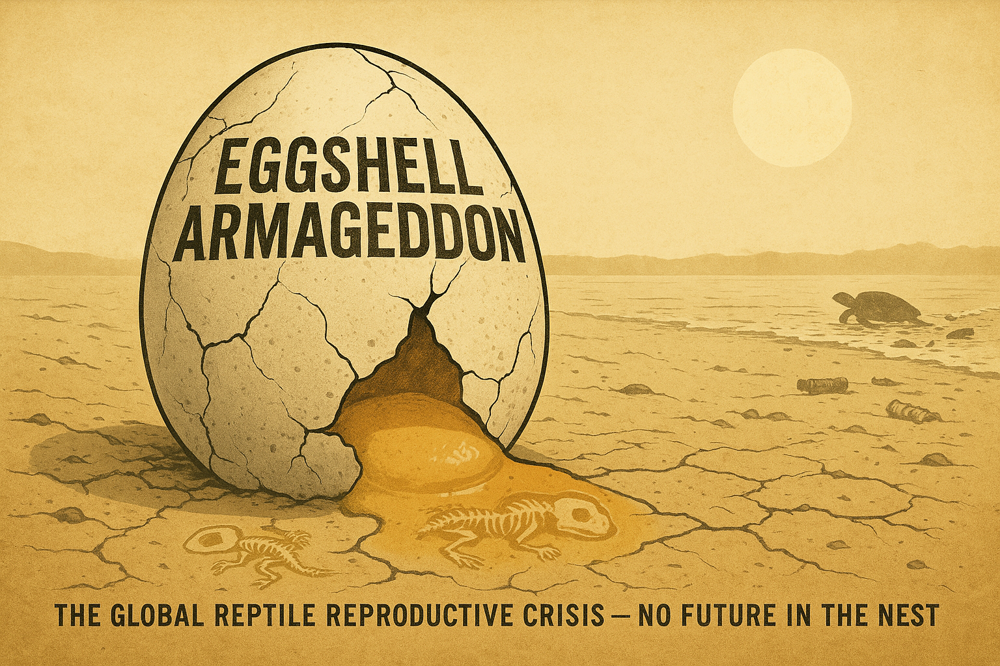

# Eggshell Armageddon

---

> **The Global Reptile Reproductive Crisis — No Future in the Nest**

---

---

---

The egg cracks open on parched earth, and what spills out is not life but amber—viscous, pooling, already turning to stone. Within that golden flood, small skeletons lie perfectly formed: the architecture of creatures that never drew breath, fossils of futures that never happened. This is not metaphor. This is the present tense of reptile reproduction in the sixth mass extinction.

For three hundred million years, reptiles have been laying eggs. Before the first mammal suckled, before the first bird sang, before flowers existed to be pollinated, reptiles were burying clutches in warm sand and walking away, trusting the earth to incubate what the earth had always incubated. The system worked through ice ages and greenhouse periods, through the splitting of continents and the rising of mountains, through the asteroid impact that ended the dinosaurs. It worked until now.

Twenty-one percent of the world's reptile species are threatened with extinction. But for many, the crisis is not adults dying in the open where we might notice and mourn. The crisis is quieter than that: eggs that never hatch, clutches that produce only daughters, shells too thin to hold their contents together. The failure happens underground, in darkness, in silence. By the time we see the population collapse, the extinction has already happened—one empty nest at a time.

---

## The Overlooked Apocalypse

They die in obscurity, the reptiles. While we catalog the charisma of mammal extinctions and compose elegies for vanishing birds, approximately eleven thousand species of turtles, crocodilians, lizards, snakes, and the singular tuatara slip toward oblivion largely unwitnessed. The IUCN Red List documents 1,829 reptile species threatened with extinction. Another 1,489 are classified as Data Deficient—a clinical term meaning we do not even know if they are dying because we have not bothered to look.

The numbers, when examined by group, tell a story of selective devastation. Turtles and tortoises—360 species, 61 percent threatened—carry the heaviest burden, victims of exploitation and habitat loss that has been ongoing since humans developed the technology to cook soup. Crocodilians fare only slightly better: 27 species, 44 percent threatened, though legal farming has relieved some hunting pressure. The roughly 6,500 lizard species and 3,800 snake species show lower percentages—19 and 18 percent respectively—but the absolute numbers still represent hundreds of evolutionary experiments approaching termination.

And then there is the tuatara. One species. One genus. One order. The sole survivor of a lineage that flourished when dinosaurs were ascendant. It has endured 200 million years of planetary upheaval. It is now listed as Vulnerable, its range restricted to a handful of New Zealand islands, its future contingent on temperature trajectories it cannot influence.

These are not peripheral creatures. Tortoises and iguanas disperse the seeds of tropical plants. Snakes consume billions of rodents annually—ecological services we would notice immediately if they ceased. Crocodilians redistribute nutrients through aquatic systems, their bodies serving as ferries for nitrogen and phosphorus. The gopher tortoise digs burrows that shelter over 350 other species. When reptiles vanish, they take these functions with them, and ecosystems begin to unravel from positions we never thought to watch.

---

## The Fatal Elegance of Temperature

Here is the mechanism of their undoing, elegant in its simplicity, catastrophic in its implications: many reptiles do not possess sex chromosomes. The distinction between male and female is not inscribed in DNA but written by temperature—determined during a narrow window of embryonic development by the warmth of the sand, the depth of the nest, the angle of the sun. This is temperature-dependent sex determination, and it governs the reproductive futures of all crocodilians, most turtles and tortoises, some lizards, and the tuatara.

For most turtle species, cooler incubation temperatures produce males, warmer temperatures produce females. The pivotal temperature—the precise point that yields equal numbers of each sex—typically falls within a range of one to two degrees Celsius. Consider the loggerhead sea turtle: below 27.7°C, clutches hatch entirely male; above 31°C, entirely female. The window between these thresholds is narrow enough to walk across in three steps.

This system evolved over 200 million years of relatively stable climate. It served reptiles through variations in temperature that occurred over millennia, allowing gradual behavioral and distributional adjustments. But we are not offering millennia. We are offering decades. And the pivotal temperatures that seemed so stable are now being crossed like lines in sand—which, in fact, they are.

The data from major sea turtle nesting beaches reads like a countdown. At the northern Great Barrier Reef, recent studies found 99.1 percent of juvenile and subadult green turtles were female. Cooler southern beaches produced 65 percent female—still skewed, but functional. Florida's loggerhead beaches have recorded up to 97 percent female hatchlings in recent hot years. Mediterranean populations trend in the same direction.

The mathematics here are not complex, merely terrible. If 99 percent of hatchlings are female, the males must come from somewhere—from cooler years that arrive less frequently, from cooler beaches that are warming too. Adult males can mate with multiple females, providing some buffer, but there are limits to this compensation. Genetic diversity narrows. Inbreeding increases. The population becomes a clock running down.

At current warming rates, some turtle populations will produce no males within decades. Not zero males in a particularly hot year, but zero males ever again, as the temperatures that once produced them become historical artifacts. The species will persist for a time as aging females continue their ancient rituals—crawling up beaches, digging nests, depositing eggs that cannot possibly hatch into anything male. The last generation will not know it is the last. It will simply produce daughters until there are no more daughters to produce.

Crocodilians face the same fundamental vulnerability with reversed polarity: higher temperatures produce males. American alligators incubated above 33°C emerge almost entirely male. Climate warming could skew populations toward male dominance, but wetland destruction reduces nesting habitat regardless of temperature. The pressures compound, converging from multiple directions on populations that cannot adapt quickly enough to evade any of them.

The tuatara embodies this crisis in singular form. Its pivotal temperature is 22°C. Current nesting temperatures on its island refugia are approaching this threshold. Warming of 1.5 degrees Celsius—the supposedly "safe" target of international climate agreements—could push all tuatara nests past the point of male production. A lineage that survived the extinction event that killed the dinosaurs may not survive the carbon dioxide we have added to the atmosphere since the Industrial Revolution.

---

## The Chemical Castration

If temperature were the only threat, the situation would be dire enough. But the eggs face another assault, invisible and pervasive: endocrine-disrupting chemicals that interfere with hormone systems at concentrations measured in parts per billion. These compounds are everywhere now—in the water, in the soil, in the tissues of animals from the tropics to Antarctica. They are particularly dangerous to developing embryos, where hormonal signals orchestrate the intricate work of building bodies.

DDT provides the clearest historical example. Though banned in most countries since the 1970s, its breakdown product DDE persists in soils and sediments, bioaccumulating in long-lived predators, disrupting calcium metabolism in ways that thin eggshells. Brown pelicans once produced eggs so fragile that nesting parents crushed them simply by sitting down. Peregrine falcon populations crashed 90 percent before the ban took effect. Bald eagles nearly vanished from reproductive failure alone.

Reptiles, with their long lifespans and position in food webs, concentrate these persistent compounds. Some populations still experience shell-thinning effects decades after DDT application ceased. The chemical's half-life in environment exceeds its half-life in public memory; we have forgotten the danger while the danger continues its slow work.

Newer chemicals bring newer disruptions. Atrazine—the second most widely used herbicide on Earth, applied at 80 million pounds annually in the United States alone—causes feminization of male amphibians and reptiles at concentrations far below regulatory thresholds. Research at UC Berkeley documented effects at 0.1 parts per billion: ten percent of male frogs developing into functional females, 75 percent of males rendered chemically sterile, complete sex reversal in animals exposed to concentrations that pass through municipal water treatment systems unchanged.

These findings have been replicated across species. The regulatory response has been notably absent. The European Union banned atrazine; it remains legal and widely used in the United States, running off fields into streams where reptile embryos develop in water that is, effectively, a dilute hormone treatment.

The latest wave of reproductive toxins goes by the acronym PFAS—per- and polyfluoroalkyl substances, the "forever chemicals" that do not break down naturally, that persist in tissue and accumulate through food webs, that now contaminate 45 percent of U.S. tap water and have been found in wildlife on every continent. Over 12,000 PFAS compounds exist. Fewer than 100 have been studied for health effects. We are conducting a planetary-scale experiment in endocrine disruption, using reptile populations as unwitting test subjects, recording the results only sporadically and responding to them not at all.

---

## No Place to Nest

A sea turtle returns to the beach where it hatched—an act of navigation so precise that scientists still do not fully understand how it is accomplished, across thousands of miles of featureless ocean, to a specific stretch of sand. This behavior is imprinted, instinctual, unalterable. The turtle does not know that the beach it seeks has been developed, that the sand has been mined, that artificial lights now blaze where moonlight once guided hatchlings to the sea.

Forty percent of Florida's beaches have been developed. Mediterranean nesting sites face intensive tourism pressure. Southeast Asian beaches disappear under resort construction. Caribbean coastlines are armored against erosion with seawalls that destroy the soft substrate turtles require for nesting. The beaches still exist in some cartographic sense, but they no longer function as nurseries.

Light pollution extends the zone of mortality inland. Hatchlings emerge from nests at night, oriented by evolutionary instruction toward the brightest horizon—which, for millions of years, was the moon reflecting off the ocean. Now the brightest horizon is often a parking lot, a hotel lobby, a coastal highway. The hatchlings crawl away from the sea, exhausting themselves on pavement, falling into storm drains, dying of dehydration and predation and crushing before sunrise reveals their error. Documented hatchling mortality from light disorientation runs into thousands annually, but the documentation is incomplete, and the actual toll is certainly higher.

Sand mining removes the substrate itself. Global demand for sand—for concrete, for glass, for land reclamation—runs to 50 billion tons annually, and beach sand is specifically targeted for its properties. Some nesting beaches are being mined faster than natural processes can replenish them. In parts of the world, the beach literally disappears between nesting seasons.

Freshwater turtles face habitat destruction in its most comprehensive form. Wetlands—their primary habitat—have declined by 35 percent since 1970, by 21 to 87 percent since 1700 depending on region. Two-thirds of the world's rivers are now dammed or fragmented. Floodplains have been converted to agriculture. Riparian areas—the riverbanks and lakeshores where freshwater turtles nest—are developed or farmed to the water's edge, leaving no buffer, no suitable substrate, no refuge.

The Yangtze giant softshell turtle once inhabited rivers across China and Vietnam. One confirmed individual remains—a single animal representing an entire species, waiting for a mate that almost certainly does not exist. The Asian narrow-headed softshell is critically endangered. The Indian peacock softshell is listed as vulnerable and declining. These are not obscure creatures; they are members of a group that has persisted since before the dinosaurs, watching their habitat converted into rice paddies and hydroelectric reservoirs and industrial discharge zones.

---

## The Direct Take

Turtles and tortoises are among the most exploited animals on Earth, desired for their meat, their eggs, their shells, their living bodies. CITES data records over 1.1 billion turtles legally exported between 1990 and 2020. The illegal trade adds millions more, uncounted and untracked, moving through networks that span continents.

Southeast Asia serves as both consumption hub and trade corridor. China drives demand for food, traditional medicine, and the pet trade. Turtle meat is considered a delicacy; turtle shells are ground into preparations of dubious medicinal value; live animals are collected for display and status. The radiated tortoise of Madagascar—once numbering in the millions—is now seized in raids yielding ten thousand animals at a time, each seizure representing a fraction of actual take, the population collapsing faster than any conservation intervention can stabilize it.

The pet trade targets the rare and beautiful with particular intensity. Social media amplifies desire for unusual species; a viral photograph of an attractive reptile can spike collection pressure within days. Entire populations can be collected out—every individual removed from a limited range before regulations can be implemented, before scientists even complete their species descriptions. The market pays premium prices for scarcity, creating incentives that function as extinction accelerators.

---

## The Compounding

These pressures do not operate in isolation. A sea turtle runs a gauntlet that begins before hatching and continues until death, each life stage presenting its own array of threats.

The nesting beach may be developed, artificially lit, eroded by storms intensified by climate change. The eggs incubate in sand that is too warm, skewing sex ratios female, while chemical contamination from agricultural runoff disrupts hormone systems. The hatchlings emerge disoriented by artificial light, crawling toward death in parking lots, predated by invasive species that patrol beaches their native predators would not have tolerated.

The juveniles that reach the ocean face plastic ingestion—mistaking floating debris for jellyfish, filling their stomachs with material that cannot be digested or passed. They face fishing bycatch, entangled in nets and longlines set for other species. They face boat strikes in crowded coastal waters.

The adults that survive to maturity carry accumulated toxins in their tissues, navigate through polluted waters, return to nest on beaches that may no longer exist in any functional sense. The survival rate from egg to reproductive adult under natural conditions was approximately one in a thousand. We have made those odds worse across every life stage.

And here is the particular cruelty of the situation: many reptile populations are already committed to extinction but do not yet appear to be dying. This is the phenomenon of extinction debt—the lag between the failure of reproduction and the disappearance of adults. Long-lived species can persist for decades as aging individuals, their numbers appearing stable, their populations actually composed of the last generation that will ever exist.

Giant tortoises can live more than a century. A population that stopped successfully reproducing in the 1980s might not visibly decline until the 2080s, when the last adults finally die of old age. Sea turtles live forty to sixty years; adults nesting today may have hatched under cooler conditions that no longer exist. The beaches seem populated, the nests seem full, but the hatchlings skew female beyond viability, and the adults are irreplaceable. When the decline becomes visible, it will be far too late to reverse. The extinction will have happened in the quiet decades before, one unhatched egg at a time.

---

## Testimony for the Record

The tuatara survived the Chicxulub impact that ended the Cretaceous, weathered the chaos of a world transformed by nuclear winter and wildfire and acid rain. It emerged into a planet stripped of its dominant reptiles, finding niches in a new world order. Now it faces extinction from a temperature increase smaller than the difference between a warm day and a cool one.

Green sea turtles have been navigating to their natal beaches for 100 million years, since the Western Interior Seaway divided North America. They have outlasted continental drift, outlasted sea level oscillations of hundreds of feet, outlasted every climatic perturbation the planet has produced. Now they produce clutches that are 99 percent female, and the beaches they return to are condominiums.

The radiated tortoise of Madagascar carries a shell patterned like sunlight through leaves, evolved over millions of years of island isolation. It is being poached to extinction in real-time, seized by the thousands, sold for soup and pets and traditional medicine, its population crashing faster than the mathematics of reproduction can stabilize.

These are evolutionary lineages older than flowering plants, older than mammals, older than birds. They have persisted through five mass extinction events. They are failing the sixth because we decided to change the climate in decades rather than millennia, to saturate the environment with synthetic hormones, to develop every beach and drain every wetland and eat every turtle we could catch.

We have made the future into the past. The eggs are fossils before they hatch.

---

## What Would Actually Be Required

Saving reptiles from reproductive collapse would require immediate, systemic action at every level: shading nests and relocating eggs to cooler sites as emergency measures while addressing the climate change that makes such measures necessary; banning atrazine and phasing out PFAS and enforcing existing pesticide regulations that are currently implemented only on paper; protecting remaining nesting habitat and restoring what has been degraded; enforcing wildlife trade laws and targeting consumer demand in the markets that drive exploitation.

It would require treating climate change as the reproductive emergency it is for temperature-dependent species—recognizing that every fraction of a degree of warming translates directly into skewed sex ratios, failed clutches, terminated lineages. It would require agricultural transformation away from chemical-intensive monoculture toward systems that do not poison the water where embryos develop. It would require expanding protected areas to thirty percent of land and sea, then actually protecting them.

It would require, in short, valuing reptile reproduction more than we value the conveniences and profits that currently take precedence. The timeline problem is that even if we began all of this tomorrow, some populations have already crossed thresholds from which recovery is not possible. Chemical contamination persists for decades. Habitat restoration takes years. Climate warming is committed for centuries. We cannot save all reptile species. The question is how many we choose to lose.

---

## The Testimony of the Egg

The egg cracks open on cracked earth under a bleached sun, and what emerges is not life but evidence. The small skeletons in the amber yolk are perfectly formed—every bone in place, every structure correct, the architecture of creatures that simply never animated. They are fossils now, or will be soon enough, indistinguishable from the remains of species that died in previous extinctions, readable only as specimens in a record we are writing.

A single sea turtle crawls toward the horizon, where the pale disc of the sun offers no promise. The landscape is sepia, ochre, amber—the colors of desiccation, of age, of things already past. The cracks in the earth mirror the cracks in the shell. Everything is the same color because everything is dying of the same cause.

Temperature-dependent sex determination was not a flaw. It was an elegant solution that worked for 200 million years, through conditions that would seem catastrophic by any human measure. It failed only when one species—ours—decided to change the planetary thermostat faster than evolution could respond.

The reptiles asked nothing of us except to be left alone. They asked only to continue the cycles of nesting and hatching that had persisted since before our ancestors descended from the trees. We answered with chemistry and warming and bulldozers, and now the eggs crack open to release fossils.

There is no future in the nest. Not because the reptiles have failed, but because we have failed them.

The yolk pools on parched earth. The skeletons settle into sediment. The sun bleaches everything the same color—the color of endings, the color of evidence, the color of the fossil record we are adding to with every unhatched egg.

This is the testimony we leave: that we knew, and did not act. That we watched the mathematics of extinction unfold and chose not to change the variables. That we made the future into the past, and left only the shells behind.

---

## Sources

This article synthesizes data from the following primary sources:

- IPBES Global Assessment (2019)
- Richardson et al., "Earth beyond six of nine planetary boundaries" (2023)
- Ramsar Convention, Global Wetland Outlook (2018)
- Davidson, "How much wetland has the world lost?" (2014)
- Dirilgen et al., "Moving past neonicotinoids" (2023)
- USGS, "PFAS in U.S. tap water" (2023)
- IPCC AR6 WGII (2022)

---

*Article generated as part of the Sixth Mass Extinction documentation project.*

> The eggs are fossils before they hatch. We have made the future into the past.
