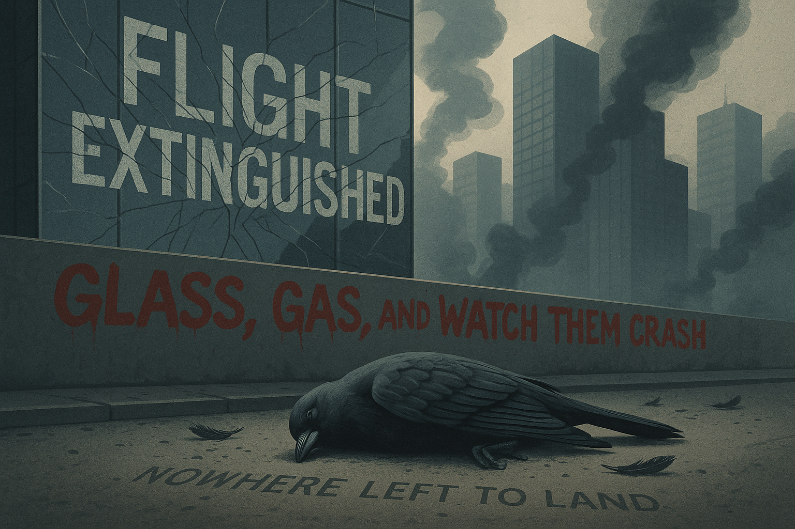

# Flight Extinguished

## Glass, Gas, and Watch Them Crash — Nowhere Left to Land

---

## Executive Summary

Birds face an unprecedented mortality crisis. Every year, up to **1 billion birds die from window collisions in the United States alone**—their hollow bones shattered against glass they cannot see. Light pollution draws millions of migrants off course into urban death traps. Climate change disrupts migratory timing, breeding success, and food availability. Habitat destruction eliminates nesting sites and stopover refuges. The cumulative toll: **3 billion breeding birds lost from North America since 1970**—a 29% decline in just 50 years.

**48% of all bird species worldwide are declining.** The sky is falling silent.

---

## The 3 Billion Bird Catastrophe

### The Breeding Bird Survey Revelation

In 2019, a landmark study published in *Science* quantified what ornithologists had long suspected: birds are disappearing at catastrophic rates.

**North American Decline (1970-2019):**

| Category | Birds Lost | Percentage Decline |
| -------- | ---------- | ------------------ |
| **Total breeding birds** | 2.9 billion | 29% |
| Grassland birds | 720 million | 53% |
| Forest birds | 1 billion+ | 33% |
| Shorebirds | 37% | |
| Aerial insectivores | 32% | |

**What This Means:**

- Nearly 1 in 3 birds has disappeared
- The decline spans all habitats and species groups
- Losses accelerated in recent decades
- Similar patterns observed globally

### Global Bird Status

**IUCN Assessments (2024):**

- **13% of bird species** threatened with extinction
- **48% of bird species** declining
- Only 6% showing population increases
- 39% stable; 7% unknown trend

**Species at the Brink:**

- Spix's macaw: Extinct in wild
- California condor: ~500 individuals (up from 22)
- Kakapo: ~200 individuals
- Philippine eagle: ~800 individuals
- Hawaiian honeycreepers: Multiple species extinct or near-extinct

### The "Common Bird" Collapse

Most alarming is not the decline of rare species—those have always been vulnerable—but the collapse of once-abundant birds:

**Formerly Common Species in Steep Decline:**

- House sparrow: 80% decline in UK since 1970s
- Barn swallow: 40% decline in Europe
- Evening grosbeak: 92% decline in North America
- Chimney swift: 72% decline
- Common nighthawk: 58% decline
- Bobolink: 65% decline

**The Silent Spring Warning:**

Rachel Carson warned of this in 1962. Sixty years later, the spring grows ever quieter.

---

## Glass: The Invisible Killer

### The Scale of Window Mortality

Birds cannot see glass. What appears to humans as a transparent barrier appears to birds as either empty space or, when reflecting vegetation and sky, as flyable habitat.

**Annual Window Collision Deaths (United States):**

| Building Type | Estimated Deaths | Percentage |
| ------------- | ---------------- | ---------- |
| Residential (low-rise) | 253-988 million | 44% |
| Commercial (low-rise) | 339-976 million | 56% |
| High-rise buildings | 16-42 million | 1% |
| **Total** | **365 million - 1 billion** | |

**The Math:**

- United States: 365 million - 1 billion deaths annually
- Canada: 16-42 million deaths annually
- European Union: 80-100+ million deaths annually
- Global estimate: 1+ billion deaths annually (conservative)

### Why Glass Kills

**The Transparency Problem:**

- Birds see through glass to habitat beyond
- Attempt to fly to trees, sky visible through building
- Impact at flight speed (20-50 mph) is typically fatal

**The Reflection Problem:**

- Reflective glass mirrors surrounding environment
- Birds see reflected trees, sky as real habitat
- Attack "competitors" reflected in glass (territorial species)
- Predators pursuing prey into reflections

**The Light Problem:**

- Interior lights attract nocturnal migrants
- Birds circle illuminated buildings until exhaustion
- Single building can kill hundreds in one night during migration

### The Deadliest Buildings

Not all buildings are equal killers. Studies identify characteristics of high-mortality structures:

**High-Risk Features:**

- Large expanses of glass
- Reflective or mirrored surfaces
- Glass corridors and skyways
- Glass railings on balconies
- Windows facing vegetation
- Buildings in flight corridors

**Case Study: McCormick Place, Chicago:**

- Glass convention center on Lake Michigan migration corridor
- 40,000+ birds killed 1978-2016 (documented; actual higher)
- Peak single night: 1,500+ birds
- Eventually implemented bird-safe modifications

### Solutions That Exist But Are Not Implemented

**Proven Interventions:**

- UV-reflective glass patterns (birds see UV; humans do not)
- Fritted glass (ceramic dots or lines)
- External screens or netting
- Film applications (adhesive patterns)
- Reduced nighttime lighting
- "Lights Out" programs during migration

**The Barrier:**

- Building codes do not require bird-safe design
- Architects prioritize aesthetics over bird safety
- Retrofitting existing buildings is expensive
- Voluntary programs have limited uptake

San Francisco, Toronto, New York, and other cities have implemented bird-safe building requirements. They remain exceptions, not the rule.

---

## Gas: Fossil Fuels and the Climate Catastrophe

### Climate Change as Bird Killer

While glass provides direct mortality, climate change reshapes the conditions for bird survival at continental scales.

**Temperature Effects:**

- **Range shifts:** Birds moving poleward 17 km per decade
- **Elevation shifts:** Mountain species pushed upward
- **Phenological mismatch:** Breeding timing misaligned with food availability
- **Extreme weather:** Heat waves, storms causing mass mortality

### The Timing Problem

Migratory birds evolved to arrive at breeding grounds when food is most abundant—typically when caterpillars peak for insectivores, or when seeds mature for granivores. Climate change disrupts this synchrony:

**Documented Mismatches:**

- **European pied flycatcher:** Arriving after caterpillar peak; chick starvation
- **Great tit:** Spring phenology advancing faster than arrival timing
- **Red knot:** Arctic breeding misaligned with snowmelt and insect emergence
- **Neotropical migrants:** Tropical wintering grounds give no cues about temperate spring

**The Mechanism:**

Birds time migration by day length (photoperiod), which climate does not affect. But food availability tracks temperature and precipitation, which climate is changing. The cues no longer match the conditions.

### Habitat Loss from Climate Change

Climate change does not just shift habitats—it destroys them:

**Forest Die-Off:**

- Bark beetle outbreaks in warming forests
- Drought stress killing trees
- Increased wildfire frequency and severity
- Montane forests contracting

**Wetland Loss:**

- Prairie potholes drying in drought
- Coastal marshes drowning under sea level rise
- Snowpack reduction affecting rivers and riparian zones
- Timing of floods changing

**Arctic Transformation:**

- Permafrost thaw changing tundra vegetation
- Shrub expansion into tundra
- Earlier snowmelt altering breeding habitat
- Arctic specialist species: nowhere colder to go

### Direct Fossil Fuel Impacts

Beyond climate, fossil fuel infrastructure directly kills birds:

**Oil and Gas Infrastructure:**

- **Oil pits and wastewater ponds:** 500,000-1,000,000 birds killed annually in U.S.
- **Oil spills:** Deepwater Horizon killed 800,000+ birds
- **Flare stacks:** Attract and incinerate nocturnal migrants
- **Pipelines:** Collisions and habitat fragmentation

**Power Lines:**

- Electrocution (primarily raptors): Millions annually
- Collision with lines: Millions more
- Right-of-way maintenance destroys habitat

---

## Light: Pollution That Guides to Death

### The Magnetic Disruption

Birds navigate using multiple cues: stars, sun position, Earth's magnetic field. Artificial light interferes with all of these.

**How Light Pollution Kills:**

- **Disorientation:** Birds drawn toward lit areas
- **Circling behavior:** Exhaustion from circling light sources
- **Collision:** Crashing into illuminated structures
- **Grounding:** Landing in unsuitable habitat
- **Increased predation:** Illuminated birds become targets

### The Toll of Light Pollution

**Documented Mass Mortality Events:**

- **9/11 Tribute in Light:** 160,000 birds affected per year (modified to reduce impact)
- **Tall buildings during migration:** Hundreds killed in single nights
- **Communication towers:** 6.8 million birds killed annually in U.S.
- **Stadium lights:** Mass kills documented at sporting events

**The Global Extent:**

- 83% of world population lives under light-polluted skies
- Light pollution increasing 2% annually
- Major migration corridors cross heavily illuminated regions
- Birds cannot avoid what covers continents

### Beaconing Effects

Certain light sources are particularly deadly:

**Communication Towers:**

- Red lights attract nocturnal migrants
- Birds circle towers until exhaustion
- Single tower can kill 5,000-50,000 birds per year
- U.S. towers: 6.8 million bird deaths annually

**Lighthouses and Offshore Platforms:**

- Isolated lights in dark environments are beacon traps
- Birds mass around light sources during migration
- Historical lighthouse kills exceeded 50,000 in single nights
- Oil platforms at sea create deadly attraction zones

---

## Nowhere Left to Land

### Habitat Destruction as Root Cause

While collisions, climate, and light cause dramatic mortality, habitat destruction underlies the structural decline:

**Grassland Birds:**

- North American grasslands: 70%+ converted to agriculture
- Grassland birds: 53% population decline
- Meadowlark, grasshopper sparrow, bobolink: precipitous declines
- No grassland to nest in = no grassland birds

**Forest Birds:**

- Amazon deforestation: 20% destroyed
- Southeast Asian rainforests: 80% loss
- Temperate forests: Fragmented
- Boreal forests: Industrial logging ongoing

**Wetland Birds:**

- Wetlands: 35% lost since 1970
- Shorebirds: 37% decline
- Waterfowl: Many species declining
- Prairie potholes: "Duck factories" drying

**Coastal and Marine:**

- Mangroves: 35% lost since 1980
- Seabird populations: Crashing due to overfishing
- Beach nesting: Tourism development
- Coral reef decline: Affects reef fish that seabirds eat

### The Aerial Insectivore Crash

Birds that eat flying insects—swallows, swifts, nightjars, flycatchers—have declined faster than almost any other group.

**Aerial Insectivore Decline:**

- Chimney swift: 72% decline
- Common nighthawk: 58% decline
- Barn swallow: 40% decline (Europe)
- Eastern whip-poor-will: 69% decline

**Causes:**

- **Insect decline:** Less prey available
- **Neonicotinoid pesticides:** Killing insect food base
- **Climate change:** Timing mismatches
- **Habitat loss:** Nesting sites destroyed

When insects decline, the birds that eat them decline. The aerial insectivore crash is inseparable from the insect apocalypse.

### Migratory Connectivity

Migratory birds require intact habitat across their entire range:

- Breeding grounds (often temperate/arctic)
- Stopover sites (refueling points)
- Wintering grounds (often tropical)

**The Chain Breaks:**

Protect breeding grounds but destroy stopover sites: species declines. Protect everything but winter habitat: species declines. The entire chain must remain intact.

**Case Study: Red Knot**

- Breeds in Arctic
- Stops at Delaware Bay to eat horseshoe crab eggs
- Winters in South America
- Horseshoe crab overharvest → Red knot decline

---

## The Invisible Holocaust

### Cats: The Overlooked Killer

Domestic and feral cats are among the deadliest bird predators:

**Annual Bird Deaths from Cats (United States):**

- **Feral cats:** 1.3-4 billion birds
- **Owned cats:** 250-500 million birds
- **Total:** 1.4-4.4 billion birds annually

**Context:**

Cat predation may kill more birds than all other anthropogenic causes combined. Unlike window collisions (primarily affects common species), cats disproportionately kill vulnerable species that nest near ground level.

**The Controversy:**

This data triggers intense debate. Cat advocates dispute numbers, oppose euthanasia. Bird advocates note that cats are invasive predators. Both acknowledge the scale of mortality is enormous.

### Pesticides: The Silent Poison

Modern pesticides kill birds both directly and through food chain disruption:

**Direct Poisoning:**

- Granular pesticides mistaken for seeds
- Secondary poisoning from eating poisoned prey
- Acute toxicity from spray exposure

**Indirect Effects:**

- Insect decline eliminates food base
- Seed treatments poison early bird food sources
- Sublethal effects impair reproduction, immune function
- Neonicotinoids: Particularly implicated in bird declines

### Cumulative Mortality

Birds face death from multiple sources simultaneously:

| Mortality Source | Annual Deaths (U.S.) |
| ---------------- | -------------------- |
| Cats | 1.4-4.4 billion |
| Window collisions | 365 million - 1 billion |
| Vehicle collisions | 200-340 million |
| Power line electrocution | 8-57 million |
| Communication towers | 6.8 million |
| Oil pits | 500,000-1 million |
| **Total (conservative)** | **2+ billion** |

These are U.S. numbers only. Global mortality is vastly higher.

---

## Cascading Ecological Consequences

### Birds as Ecosystem Engineers

Birds perform irreplaceable ecological functions:

**Seed Dispersal:**

- 90%+ of tropical tree species depend on animal dispersal
- Many birds sole dispersers for large-seeded plants
- Forest regeneration fails without dispersers
- Island extinctions demonstrate cascades

**Pest Control:**

- Insectivorous birds consume billions of insects daily
- Crop pest control valued at $4-5 billion annually in U.S.
- Forest health depends on insect control
- Bird decline → insect outbreak → crop damage

**Pollination:**

- Hummingbirds: Critical pollinators in Americas
- Sunbirds, honeyeaters: Old World equivalents
- Specialist plant-bird relationships
- Some plants entirely dependent on bird pollinators

**Nutrient Transfer:**

- Seabirds transport marine nutrients to land via guano
- Guano islands: Among richest fertilizer sources
- Salmon-eating birds: Nitrogen transfer to forests
- Nutrient cycling disrupted by bird decline

### The Extinction Cascade

When birds disappear, ecosystems transform:

**Guam: The Canary in the Coal Mine**

- Brown tree snake introduced post-WWII
- 12 of 13 native forest bird species extinct or extirpated
- Forest now eerily silent
- Spider populations exploded (no bird predation)
- Tree regeneration failing (no seed dispersal)
- 60-90% fewer seedlings in some areas

Guam is not a warning—it is a model. This is what birdless forests look like.

### Silent Spring Realized

Rachel Carson's 1962 warning envisioned springs without birdsong. We are living it:

- Morning choruses noticeably diminished
- Suburban yards that once hosted dozens of species now host handfuls
- Long-time birders report consistent decline at familiar sites
- The silence is not imagined—it is measured

---

## What Would Actually Be Required

### Immediate Actions

**For Window Collisions:**

- Mandate bird-safe glass in new construction
- Retrofit high-mortality buildings
- Implement "Lights Out" programs during migration
- Fund research into most effective deterrent patterns

**For Habitat:**

- Halt grassland conversion immediately
- Restore wetlands at scale
- Protect remaining forest
- Create wildlife corridors connecting fragments

**For Direct Mortality:**

- Reduce cat access to outdoors (TNR insufficient)
- Phase out granular pesticides
- Convert communication tower lights to bird-safe patterns
- Cover oil pits and wastewater ponds

**For Climate:**

- Reduce emissions 50% by 2030
- Protect climate refugia
- Assist adaptation where possible
- Accept some losses are inevitable

### Systemic Changes

- **Agricultural transformation:** End monoculture, restore habitat within farming landscapes
- **Building codes:** Require bird-safe design universally
- **Energy transition:** From fossil fuels to renewables (with bird-safe siting)
- **Land use reform:** Protect remaining natural habitat

### The Funding Gap

Current bird conservation funding:

- Partners in Flight: ~$20 million annually
- Migratory Bird Joint Ventures: ~$50 million
- Land and Water Conservation Fund: ~$900 million (all species)

**Estimated need:** $20+ billion annually to reverse declines

The gap is not knowledge—we know what to do. The gap is will.

---

## The Uncomfortable Truth

We are witnesses to an extinction event in progress. The birds dying against our windows, circling our lights, starving as their food disappears—they are not victims of mysterious forces. They are victims of choices:

- The choice to build with glass rather than bird-safe alternatives
- The choice to illuminate the night rather than embrace darkness
- The choice to convert grasslands to corn rather than preserve prairie
- The choice to spray pesticides rather than tolerate insects
- The choice to continue burning fossil fuels rather than transform our energy system

**Every dead bird on a sidewalk beneath a glass tower is an indictment.**

The flight paths that birds followed for millions of years now lead to death traps. The stopovers where generations refueled are now parking lots. The insects that sustained aerial insectivores are poisoned. The climate that shaped breeding cycles is unrecognizable.

Birds evolved flight 150 million years ago. They survived the asteroid that killed dinosaurs. They will not survive the Anthropocene—not because they cannot adapt, but because we will not let them.

**There is nowhere left to land.** We have paved, developed, illuminated, and poisoned every surface. The glass towers reflect a sky that is emptying of wings.

The silence is not coming. It is here.

---

## Sources

This article synthesizes data from the following primary sources (see SOURCE_MATRIX.md for full citations):

- [S1] IPBES Global Assessment (2019)
- [S3] Ceballos et al., "Biological annihilation" (2017)
- [S9] IPBES Invasive Alien Species Assessment (2023)
- [S19] IPBES Pollinators Assessment (2016)
- [S20] Dirilgen et al., "Neonicotinoids and bees" (2023)
- [S27] Jaureguiberry et al., "Direct drivers of biodiversity loss" (2022)
- [S28] IPCC AR6 (2022)

Additional bird-specific sources:

- Rosenberg et al., "Decline of North American avifauna" (2019) Science
- Loss et al., "Bird-building collisions" (2014) Condor
- Loss et al., "Cat predation on birds" (2013) Nature Communications

---

*Article generated as part of the Sixth Mass Extinction documentation project.*

> The sky is not falling. The birds are. One window strike at a time, one light trap at a time, one lost habitat at a time. Flight, the gift that defined birds for 150 million years, has become their death sentence in our world of glass and gas.
