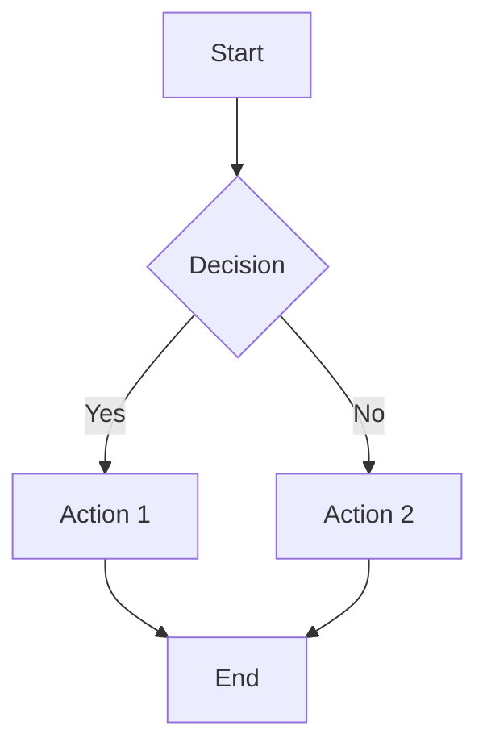
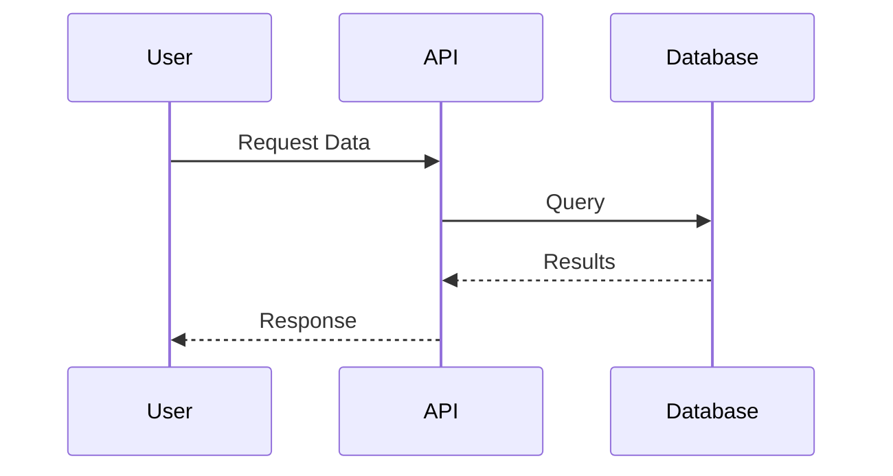
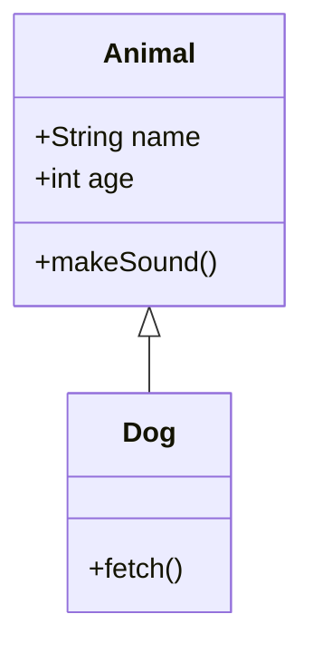

<!--
✒ Metadata
    - Title: Markdown Lint Standards Guide (digiSpace Edition - v1.1)
    - File Name: MARKDOWN_LINT_STANDARDS.md
    - Relative Path: docs/standards/MARKDOWN_LINT_STANDARDS.md
    - Artifact Type: docs
    - Version: 1.1.1
    - Date: 2025-01-03
    - Update: Friday, January 03, 2025
    - Author: Dennis 'dnoice' Smaltz
    - A.I. Acknowledgement: Anthropic - Claude Opus 4.5
    - Signature: ︻デ═─── ✦ ✦ ✦ | Aim Twice, Shoot Once!

✒ Description:
    The definitive markdown linting standards guide for ALL markdown artifacts across
    ALL projects—past, present, and future. Enforces consistent formatting, proper
    heading hierarchy, valid links, and professional document structure following
    vscode-markdownlint defaults. Includes extended conventions for math, diagrams,
    admonitions, and specialized markdown features.

✒ Key Features:
    - Feature 1: Complete markdownlint rule reference with MD codes
    - Feature 2: Category-organized rules (headings, lists, code, tables, etc.)
    - Feature 3: Wrong vs. correct examples for every common violation
    - Feature 4: Document structure template for quick starts
    - Feature 5: Pre-flight checklist for artifact validation
    - Feature 6: Configuration file reference for IDE integration
    - Feature 7: Blockquote and emphasis best practices
    - Feature 8: Spacing and whitespace rules for clean documents
    - Feature 9: Link and image accessibility standards
    - Feature 10: Table formatting specifications
    - Feature 11: Extended conventions (math, mermaid, admonitions, footnotes)
    - Feature 12: Task lists, definition lists, and front matter standards
    - Feature 13: Horizontal rule and escape character guidelines

✒ Usage Instructions:
    This document serves as the authoritative reference for markdown formatting.

    How to use:
        1. Reference this guide when creating any .md file
        2. Run pre-flight checklist before finalizing artifacts
        3. Copy .markdownlint.json to project root for IDE linting
        4. Use the document structure template as a starting point
        5. Review wrong/correct examples when fixing violations

✒ Examples:
    - Example 1: README.md for open-source projects
    - Example 2: API documentation with code samples
    - Example 3: Technical guides with nested headings
    - Example 4: Research notes with tables and blockquotes
    - Example 5: Changelog files with consistent formatting
    - Example 6: Wiki pages with internal links
    - Example 7: Project proposals with hierarchical structure
    - Example 8: Knowledge base articles with images

✒ Other Important Information:
    - Dependencies: markdownlint-cli or vscode-markdownlint extension
    - Compatible platforms: VS Code, Sublime Text, Vim, any text editor
    - File format handling: All .md and .markdown files
    - Scope: ALL markdown artifacts, ALL projects, ALL time
    - Configuration: .markdownlint.json in project root
    - Known limitations: Some rules may conflict with specific doc generators

    This document is the CONTRACT for markdown. No exceptions. No ambiguity.
---------
-->

# Markdown Lint Standards Guide

> **Philosophy:** *"︻デ═─── ✦ ✦ ✦ | Aim Twice, Shoot Once!* — Every markdown artifact ships with
> consistent, professional formatting. No exceptions. No excuses. ALL projects.

---

## Table of Contents

1. [Overview](#overview)
2. [Heading Rules](#heading-rules)
3. [List Rules](#list-rules)
4. [Code Block Rules](#code-block-rules)
5. [Blockquote Rules](#blockquote-rules)
6. [Emphasis Rules](#emphasis-rules)
7. [Spacing and Whitespace Rules](#spacing-and-whitespace-rules)
8. [Link and Image Rules](#link-and-image-rules)
9. [Table Rules](#table-rules)
10. [Extended Conventions](#extended-conventions)
    - [Math Expressions](#math-expressions)
    - [Mermaid Diagrams](#mermaid-diagrams)
    - [Admonitions and Callouts](#admonitions-and-callouts)
    - [Footnotes](#footnotes)
    - [Definition Lists](#definition-lists)
    - [Task Lists](#task-lists)
    - [Front Matter](#front-matter)
    - [Horizontal Rules](#horizontal-rules)
    - [Escape Characters](#escape-characters)
11. [Document Structure Template](#document-structure-template)
12. [Common Violations and Fixes](#common-violations-and-fixes)
13. [Pre-Flight Checklist](#pre-flight-checklist)
14. [Configuration](#configuration)

---

## Overview

All markdown artifacts must comply with markdownlint rules. This ensures consistent,
professional, and accessible documentation across every project in the digiSpace
ecosystem and beyond.

These standards follow vscode-markdownlint defaults and represent industry best
practices for markdown formatting. Every rule exists for a reason—whether for
accessibility, parser compatibility, or visual consistency.

---

## Heading Rules

Headings provide document structure and enable navigation. Proper heading hierarchy
is essential for accessibility and readability.

| Rule | Description |
| ---- | ----------- |
| MD001 | Increment heading levels by one (no jumping from `#` to `###`) |
| MD003 | Use ATX style (`# Heading`, not underlines) |
| MD018 | Space required after hash (`# Heading` not `#Heading`) |
| MD022 | Blank line before and after headings |
| MD024 | No duplicate heading text within same document |
| MD025 | Single H1 (`#`) per document — the title |
| MD041 | First line must be a top-level heading (`#`) |

### Heading Best Practices

- Start every document with a single `#` title
- Never skip heading levels (H1 → H2 → H3, never H1 → H3)
- Keep headings unique to enable anchor linking
- Always surround headings with blank lines for visual separation

---

## List Rules

Lists organize information hierarchically. Consistent list formatting improves
scanability and parser reliability.

| Rule | Description |
| ---- | ----------- |
| MD004 | Use dashes (`-`) for unordered lists |
| MD005 | Consistent indentation at same level |
| MD007 | Indent nested lists by 2 spaces |
| MD029 | Ordered lists use `1.` prefix (auto-numbered) |
| MD030 | Single space after list marker |
| MD032 | Blank line before and after lists |

### List Best Practices

- Always use dashes (`-`) for bullet points, never asterisks or plus signs
- Indent nested items exactly 2 spaces
- Use `1.` for all ordered list items (renderers auto-number)
- Surround lists with blank lines to separate from prose

---

## Code Block Rules

Code blocks display syntax-highlighted programming content. Proper formatting
ensures correct rendering across platforms.

| Rule | Description |
| ---- | ----------- |
| MD031 | Blank line before and after fenced code blocks |
| MD040 | Always specify language after opening fence |
| MD046 | Use fenced style (triple backticks, not indentation) |
| MD048 | Use backticks (`` ``` ``), not tildes (`~~~`) |

### Code Block Best Practices

- Always specify the language identifier for syntax highlighting
- Use backticks exclusively (never tildes)
- Surround code blocks with blank lines
- Prefer fenced blocks over indented code for clarity

#### No Lang_ID?

If a fenced block does not have a coresponding lang_id then choice a contextually appropriate term.

Examples of terms: diagram, tree, text. ECT.

---

## Blockquote Rules

Blockquotes highlight quoted content or callouts. Proper formatting prevents
parsing errors.

| Rule | Description |
| ---- | ----------- |
| MD027 | Single space after blockquote symbol (`>`) |
| MD028 | No blank lines inside blockquotes |

### Blockquote Best Practices

- Use `>` followed by exactly one space
- For multi-paragraph quotes, use `>` on the empty line between paragraphs
- Never leave blank lines between blockquote lines

---

## Emphasis Rules

Emphasis (bold, italic) draws attention to important content. Consistent markers
improve readability.

| Rule | Description |
| ---- | ----------- |
| MD036 | Do not use emphasis as headings (bold/italic paragraphs) |
| MD037 | No spaces inside emphasis markers |
| MD049 | Use asterisks for italics (`*italic*` not `_italic_`) |
| MD050 | Use asterisks for bold (`**bold**` not `__bold__`) |

### Emphasis Best Practices

- Always use asterisks (`*` and `**`), never underscores
- No spaces inside emphasis markers (`**bold**` not `** bold **`)
- Use actual headings (`##`) instead of bold text for sections

---

## Spacing and Whitespace Rules

Consistent whitespace ensures clean documents and prevents rendering issues.

| Rule | Description |
| ---- | ----------- |
| MD009 | No trailing spaces at end of lines |
| MD010 | No hard tabs (use spaces) |
| MD012 | No multiple consecutive blank lines |
| MD047 | File ends with exactly one newline character |

### Whitespace Best Practices

- Configure editor to trim trailing whitespace on save
- Use spaces for indentation, never tabs
- Maximum of one blank line between elements
- Ensure exactly one newline at end of file (not zero, not two)

---

## Link and Image Rules

Links and images connect content and provide visual context. Proper formatting
ensures accessibility and valid references.

| Rule | Description |
| ---- | ----------- |
| MD034 | No bare URLs (wrap in `<>` or use `[text](url)`) |
| MD039 | No spaces inside link text brackets |
| MD042 | No empty links |
| MD045 | Images must have alt text |
| MD051 | Link fragments must be valid |

### Link and Image Best Practices

- Always wrap URLs: `[Link Text](https://example.com)` or `<https://example.com>`
- Provide meaningful alt text for all images: ``
- Verify anchor links point to valid headings
- Never leave link text or URLs empty

---

## Table Rules

Tables present structured data. Consistent formatting ensures proper rendering.

| Rule | Description |
| ---- | ----------- |
| MD055 | Consistent pipe style (leading and trailing) |
| MD056 | Consistent column count across rows |
| MD058 | Blank line before and after tables |
| MD060 | Space required on both sides of pipe content |

### Table Best Practices

- Include leading and trailing pipes on every row
- Maintain consistent column count across all rows
- Surround tables with blank lines
- Use spaces around content: `| Cell |` not `|Cell|`

---

## Extended Conventions

Beyond standard markdownlint rules, these conventions ensure consistency for
specialized markdown features used across digiSpace projects.

### Math Expressions

All mathematical expressions and equations must use fenced `math` code blocks.
This ensures proper rendering across GitHub, GitLab, Obsidian, and other platforms
with LaTeX/KaTeX support.

**Inline Math:**

For simple inline expressions, use single dollar signs: `$E = mc^2$`

**Block Math:**

For standalone equations, always use fenced math blocks:

````markdown
```math
E = mc^2
```
````

**Complex Equations:**

````markdown
```math
\frac{\partial f}{\partial x} = \lim_{h \to 0} \frac{f(x + h) - f(x)}{h}
```
````

**Multi-line Equations:**

````markdown
```math
\begin{aligned}
\nabla \cdot \mathbf{E} &= \frac{\rho}{\varepsilon_0} \\
\nabla \cdot \mathbf{B} &= 0 \\
\nabla \times \mathbf{E} &= -\frac{\partial \mathbf{B}}{\partial t} \\
\nabla \times \mathbf{B} &= \mu_0 \mathbf{J} + \mu_0 \varepsilon_0 \frac{\partial \mathbf{E}}{\partial t}
\end{aligned}
```
````

**Math Best Practices:**

- Always use `math` language identifier, never unlabeled code blocks
- Use `\begin{aligned}` for multi-line equations with alignment
- Escape special characters properly in LaTeX
- Surround math blocks with blank lines like any code block

### Mermaid Diagrams

All diagrams (flowcharts, sequence diagrams, class diagrams, etc.) must use
fenced `mermaid` code blocks.

**Flowchart Example:**

````markdown

````

**Sequence Diagram Example:**

````markdown

````

**Class Diagram Example:**

````markdown

````

**Mermaid Best Practices:**

- Always use `mermaid` language identifier
- Keep diagrams readable with proper indentation
- Use descriptive node labels
- Limit complexity—split large diagrams into multiple smaller ones
- Surround mermaid blocks with blank lines

### Admonitions and Callouts

Admonitions highlight important information. Use GitHub-flavored blockquote
syntax with emoji prefixes for maximum compatibility.

**Standard Admonition Types:**

````markdown
> [!NOTE]
> Useful information that users should know, even when skimming content.

> [!TIP]
> Helpful advice for doing things better or more easily.

> [!IMPORTANT]
> Key information users need to know to achieve their goal.

> [!WARNING]
> Urgent info that needs immediate user attention to avoid problems.

> [!CAUTION]
> Advises about risks or negative outcomes of certain actions.
````

**Alternative Style (Legacy/Universal):**

For platforms without `[!TYPE]` support, use emoji prefixes:

````markdown
> **📝 Note:** This is a note with universal compatibility.

> **💡 Tip:** This is a helpful tip.

> **⚠️ Warning:** This requires attention.

> **🚨 Caution:** This is critical information.
````

**Admonition Best Practices:**

- Use `[!TYPE]` syntax for GitHub/GitLab projects
- Use emoji prefix style for maximum compatibility
- Keep admonitions concise—one to three sentences
- Don't overuse—too many callouts reduce their impact

### Footnotes

Footnotes provide supplementary information without cluttering the main text.

**Basic Footnote:**

```markdown
This claim needs a source[^1].

[^1]: Author Name, "Article Title," Publication, Year.
```

**Named Footnotes:**

```markdown
The theory was groundbreaking[^einstein] and changed physics forever.

[^einstein]: Einstein, A. "On the Electrodynamics of Moving Bodies," 1905.
```

**Multi-line Footnotes:**

```markdown
This requires extended explanation[^detailed].

[^detailed]: This is the first paragraph of the footnote.

    This is the second paragraph, indented with 4 spaces.

    - Even lists work
    - Inside footnotes
```

**Footnote Best Practices:**

- Place footnote definitions at the end of the document
- Use descriptive names for complex references (`[^einstein]` not `[^1]`)
- Keep footnotes concise when possible
- Group related footnote definitions together

### Definition Lists

Definition lists describe terms and their meanings. Support varies by platform.

**Standard Format:**

```markdown
Term 1
: Definition for term 1

Term 2
: Definition for term 2
: Alternative definition for term 2

Complex Term
: First paragraph of definition.

: Second paragraph with more detail.
```

**Definition List Best Practices:**

- Use for glossaries, API parameter descriptions, or option lists
- One blank line before the term
- Colon followed by space starts each definition (`:` then space)
- Multiple definitions for one term are allowed

### Task Lists

Task lists track completion status. Use in issues, PRs, and project documentation.

**Basic Task List:**

```markdown
- [x] Completed task
- [ ] Incomplete task
- [ ] Another pending task
```

**Nested Task List:**

```markdown
- [ ] Main task
  - [x] Subtask 1 (done)
  - [ ] Subtask 2 (pending)
  - [ ] Subtask 3 (pending)
- [x] Another completed main task
```

**Task List Best Practices:**

- Use `[x]` for completed, `[ ]` for incomplete (space required)
- Nest subtasks with 2-space indentation
- Keep task descriptions concise and actionable
- Use in combination with headings for categorized task groups

### Front Matter

YAML front matter provides document metadata. Place at the very beginning of the
file, before any other content including the HTML comment header.

**Standard Front Matter:**

```markdown
---
title: Document Title
author: Dennis 'dnoice' Smaltz
date: 2025-01-03
tags:
  - documentation
  - standards
  - markdown
status: published
---

<!--
✒ Metadata
    ...docstring header...
-->

# Document Title
```

**Front Matter Best Practices:**

- Always use `---` delimiters (three dashes)
- Place before HTML comment docstring header
- Use lowercase keys with hyphens (`created-date` not `createdDate`)
- Quote strings containing special characters
- Use arrays for multi-value fields like tags

### Horizontal Rules

Horizontal rules create visual section breaks. Use sparingly for major divisions.

**Standard Format:**

```markdown
---
```

**Horizontal Rule Best Practices:**

- Use three dashes (`---`) exclusively
- Never use asterisks (`***`) or underscores (`___`)
- Always surround with blank lines
- Use between major document sections, not minor subsections
- Don't overuse—headings usually provide sufficient separation

### Escape Characters

Escape special markdown characters when you want them rendered literally.

**Characters Requiring Escape:**

| Character | Escape | Purpose |
| --------- | ------ | ------- |
| `\` | `\\` | Backslash |
| `` ` `` | `` \` `` | Backtick |
| `*` | `\*` | Asterisk |
| `_` | `\_` | Underscore |
| `{ }` | `\{ \}` | Curly braces |
| `[ ]` | `\[ \]` | Square brackets |
| `( )` | `\( \)` | Parentheses |
| `#` | `\#` | Hash mark |
| `+` | `\+` | Plus sign |
| `-` | `\-` | Minus sign (hyphen) |
| `.` | `\.` | Dot |
| `!` | `\!` | Exclamation mark |
| &#124; | `\|` | Pipe (in tables) |

**Escape Best Practices:**

- Only escape when the character would otherwise trigger formatting
- Use code spans (backticks) for technical content instead of escaping
- In code blocks, escaping is not needed
- Test rendering to verify escapes work as intended

---

## Document Structure Template

Use this template as a starting point for all markdown documents:

````markdown
# Document Title

Brief introduction paragraph explaining the document's purpose.

## First Section

Content for the first major section.

### Subsection

More detailed content within the section.

- List item one
- List item two
  - Nested item

## Second Section

Another paragraph with a [link](https://example.com).

```bash
# Code example with language specified
echo "Hello, World!"
```

## Conclusion

Final thoughts and summary.
````

---

## Common Violations and Fixes

### Heading Jump (MD001)

**Wrong:**

```markdown
# Title
### Skipped H2
```

**Correct:**

```markdown
# Title

## Section

### Subsection
```

### Missing Code Language (MD040)

**Wrong:**

````markdown
```
echo "no language"
```
````

**Correct:**

````markdown
```bash
echo "with language"
```
````

### No Blank Lines Around List (MD032)

**Wrong:**

```markdown
Some text.
- Item one
- Item two
More text.
```

**Correct:**

```markdown
Some text.

- Item one
- Item two

More text.
```

### Bare URL (MD034)

**Wrong:**

```markdown
Check out https://example.com for more.
```

**Correct:**

```markdown
Check out <https://example.com> for more.
Check out [Example Site](https://example.com) for more.
```

### Blank Line Inside Blockquote (MD028)

**Wrong:**

```markdown
> First paragraph of the quote.

> Second paragraph of the quote.
```

**Correct:**

```markdown
> First paragraph of the quote.
>
> Second paragraph of the quote.
```

### Emphasis as Heading (MD036)

**Wrong:**

```markdown
**This looks like a heading**

Content goes here...
```

**Correct:**

```markdown
## This is a heading

Content goes here...
```

### Missing Trailing Newline (MD047)

**Wrong:**

```markdown
# Document

Final line with no newline at end.⌁
```

**Correct:**

```markdown
# Document

Final line followed by exactly one newline.
⏎
```

### Improper Table Spacing (MD060)

**Wrong:**

```markdown
|Header|Header|
|------|------|
|Cell  |Cell  |
```

**Correct:**

```markdown
| Header | Header |
| ------ | ------ |
| Cell   | Cell   |
```

---

## Pre-Flight Checklist

Before finalizing any markdown artifact, verify:

### Core Standards

1. ☐ Single `#` title on first line (after front matter if present)
2. ☐ Heading levels increment by one
3. ☐ No duplicate headings
4. ☐ Blank lines around headings, lists, code blocks, tables
5. ☐ All code fences have language identifier
6. ☐ All images have alt text
7. ☐ No trailing whitespace
8. ☐ File ends with exactly one newline (not zero, not two)
9. ☐ No bare URLs
10. ☐ Consistent list style (dashes only)
11. ☐ Table pipes have space on both sides (`| cell |` not `|cell|`)
12. ☐ No blank lines inside blockquotes (use `>` on empty line for breaks)
13. ☐ No emphasis used as headings (use actual `##` headings)

### Extended Convention Checks

1. ☐ Math expressions use `math` fenced blocks
1. ☐ Diagrams use `mermaid` fenced blocks
1. ☐ Admonitions use `[!TYPE]` or emoji prefix format
1. ☐ Footnote definitions at end of document
1. ☐ Task lists use `[x]` / `[ ]` with proper spacing
1. ☐ Front matter uses `---` delimiters (if present)
1. ☐ Horizontal rules use `---` only (not `***` or `___`)
1. ☐ Special characters escaped when needed

---

## Configuration

### VS Code Integration

Copy the following configuration to `.markdownlint.json` in your project root:

```json
{
  "default": true,
  "MD003": { "style": "atx" },
  "MD004": { "style": "dash" },
  "MD007": { "indent": 2 },
  "MD013": false,
  "MD029": { "style": "one" },
  "MD033": false,
  "MD048": { "style": "backtick" },
  "MD049": { "style": "asterisk" },
  "MD050": { "style": "asterisk" }
}
```

### Rule Exceptions

MD013 (line length) is disabled by default as it conflicts with prose writing.
MD033 (inline HTML) is disabled to allow HTML comments for metadata headers.

### CLI Usage

Lint all markdown files in a directory:

```bash
# Install markdownlint-cli
npm install -g markdownlint-cli

# Lint current directory
markdownlint "**/*.md"

# Fix auto-fixable issues
markdownlint "**/*.md" --fix
```

---

## Final Word

Markdown is the universal language of documentation. These standards ensure every
document you create is professional, accessible, and consistent—whether it's a
README, API documentation, or research notes.

No exceptions. No ambiguity. Every `.md` file follows these rules.

---

Document generated: Friday, January 03, 2025

> **︻デ═─── ✦ ✦ ✦ | Aim Twice, Shoot Once!**
