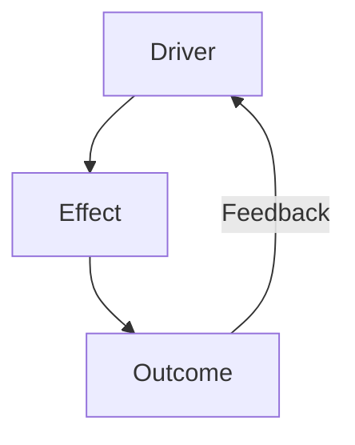

<!--
✒ Metadata
    - Title: Sub-Section Article Template (SME Edition - v1.0)
    - File Name: article_template.md
    - Relative Path: research-stacks/_templates/article_template.md
    - Artifact Type: docs
    - Version: 1.0.0
    - Date: 2026-01-05
    - Update: Sunday, January 05, 2026
    - Author: Dennis 'dnoice' Smaltz
    - A.I. Acknowledgement: Anthropic - Claude Opus 4.5
    - Signature: ︻デ═─── ✦ ✦ ✦ | Aim Twice, Shoot Once!

✒ Description:
    Comprehensive article template for Sixth Mass Extinction research stack
    sub-sections. Provides structured framework for ~1500 line deep-dive
    articles covering all facets of each episode topic with scientific rigor.

✒ Key Features:
    - Feature 1: 15-section hierarchical structure for comprehensive coverage
    - Feature 2: Integrated visualization placeholders with caption standards
    - Feature 3: Cross-reference framework linking to companion notebooks
    - Feature 4: Tiered citation system (Tier 1-4 source integration)
    - Feature 5: Key findings summary boxes for quick reference
    - Feature 6: Case study and regional analysis sections
    - Feature 7: Uncertainty acknowledgement and limitations framework
    - Feature 8: Interactive element placeholders for web deployment
    - Feature 9: Glossary and technical term definitions
    - Feature 10: Navigation aids and anchor linking structure
    - Feature 11: Methodology transparency sections
    - Feature 12: Future research directions and open questions

✒ Usage Instructions:
    Copy this template to your episode's article/ directory:
        cp _templates/article_template.md X.X-episode/article/ARTICLE_X.X.md

    Then:
        1. Replace all {PLACEHOLDER} values with episode-specific content
        2. Update metadata header with correct episode information
        3. Fill each section following the guidance comments
        4. Link to companion notebooks and visualizations
        5. Populate bibliography from sources/ directory
        6. Remove guidance comments before publication

✒ Other Important Information:
    - Dependencies: Companion notebooks (01-03), methodology documentation
    - Compatible platforms: GitHub, GitLab, Obsidian, MkDocs, Jekyll
    - Target length: ~1500 lines (comprehensive deep-dive)
    - Related templates: methods_template.md, technical_supplement_template.md
    - Cross-references: Links to research-blueprints/MB_SS-X.X.md
---------
-->

# {Episode Title}

## Sixth Mass Extinction Series {X.0}: {Section Name} | Episode {X.X}

> **Series Navigation:** [Series Index](../../../README.md) | [Section {X.0}](../../README.md) | [Episode {X.X}](../README.md)
>
> **Companion Materials:** [Notebooks](../notebooks/) | [Visualizations](../visualizations/) | [Data](../data/) | [Methodology](../methodology/)

---

## Executive Summary

<!--
GUIDANCE: 300-400 words summarizing key findings, significance, and implications.
This section should stand alone for readers who only skim the article.
Include 3-5 bullet points of critical takeaways.
-->

{Executive summary paragraph introducing the topic, its significance to the sixth mass extinction, and the key arguments presented in this article. This opening should capture the reader's attention and convey the gravity of the situation while maintaining scientific accuracy.}

{Second paragraph expanding on the primary findings and their implications. What does the evidence reveal? What are the stakes?}

{Third paragraph providing context for how this episode fits within the broader SME series narrative. How does this topic connect to other drivers, impacts, and solutions examined elsewhere?}

**Key Findings:**

- {Finding 1: Primary quantitative result with source citation}
- {Finding 2: Critical threshold or trend identified}
- {Finding 3: Causal mechanism or driver relationship}
- {Finding 4: Regional or taxonomic pattern}
- {Finding 5: Implications for biodiversity trajectory}

**Reading Time:** ~{XX} minutes | **Technical Level:** {Accessible | Intermediate | Advanced}

---

## Table of Contents

1. [Introduction](#1-introduction)
2. [Historical Context](#2-historical-context)
3. [Current State of Knowledge](#3-current-state-of-knowledge)
4. [Data and Methodology Overview](#4-data-and-methodology-overview)
5. [Primary Analysis](#5-primary-analysis)
6. [Secondary Analysis](#6-secondary-analysis)
7. [Regional Case Studies](#7-regional-case-studies)
8. [Taxonomic Patterns](#8-taxonomic-patterns)
9. [Temporal Dynamics](#9-temporal-dynamics)
10. [Causal Mechanisms](#10-causal-mechanisms)
11. [Interaction Effects](#11-interaction-effects)
12. [Projections and Scenarios](#12-projections-and-scenarios)
13. [Uncertainty and Limitations](#13-uncertainty-and-limitations)
14. [Implications](#14-implications)
15. [Conclusions](#15-conclusions)
16. [Glossary](#16-glossary)
17. [References](#17-references)
18. [Appendices](#18-appendices)

---

## 1. Introduction

### 1.1 Topic Overview

<!--
GUIDANCE: 200-300 words introducing the specific topic of this episode.
Establish why this topic matters for understanding the sixth mass extinction.
Connect to broader series themes established in Section {X.0}.
-->

{Opening paragraph establishing the topic's relevance and scope. What specific aspect of the extinction crisis does this episode address? Why does it matter? Begin with a compelling hook that draws readers into the subject matter.}

{Second paragraph providing context within the series structure. How does this episode connect to other episodes in Section {X.0}? What questions will be answered? Establish the logical flow from previous episodes and foreshadow connections to subsequent ones.}

{Third paragraph previewing the analytical approach. What kinds of evidence will be examined? What geographic and temporal scales will be considered? What makes this analysis distinct from previous treatments of the topic?}

### 1.2 Scope and Objectives

This article examines {topic} through the following analytical lenses:

1. **Quantitative Assessment:** {What metrics and measurements will be analyzed? Specify the primary indicators and data sources.}

2. **Temporal Analysis:** {What time periods and trends will be examined? Include both historical baselines and contemporary dynamics.}

3. **Spatial Patterns:** {What geographic scales and regions will be covered? Specify global patterns and regional case studies.}

4. **Causal Attribution:** {What drivers and mechanisms will be investigated? Reference the HIPPO framework where applicable.}

5. **Future Trajectories:** {What projections and scenarios will be explored? Identify the modeling frameworks or scenario approaches used.}

**Boundaries and Exclusions:**

This analysis focuses specifically on {topic scope} and does not extensively cover:

- {Excluded topic 1 - and where it is addressed in the series}
- {Excluded topic 2 - and where it is addressed in the series}
- {Excluded topic 3 - and where it is addressed in the series}

### 1.3 Guiding Questions

This episode addresses the following research questions:

> **Q1:** {Primary research question driving the analysis. This should be the central question that the article seeks to answer.}

> **Q2:** {Secondary research question exploring mechanisms. This should probe the causal factors and processes underlying the primary findings.}

> **Q3:** {Tertiary research question examining implications. This should address the significance of the findings for biodiversity, ecosystems, and human systems.}

**Sub-Questions:**

- {Sub-question 1a related to Q1}
- {Sub-question 1b related to Q1}
- {Sub-question 2a related to Q2}
- {Sub-question 3a related to Q3}

### 1.4 Article Structure

The analysis proceeds through fifteen major sections:

**Sections 1-4** establish context, reviewing historical background, current scientific understanding, and the data and methods used in this analysis.

**Sections 5-6** present the primary and secondary analytical findings, addressing the core research questions with quantitative evidence.

**Sections 7-9** explore variation across space (regional case studies), taxa (taxonomic patterns), and time (temporal dynamics).

**Sections 10-11** examine causal mechanisms and interaction effects, explaining why the observed patterns exist and how multiple factors combine.

**Sections 12-13** look forward with projections and scenarios while honestly acknowledging uncertainties and limitations.

**Sections 14-15** synthesize implications and conclusions, connecting findings to the broader extinction narrative and identifying priorities for action and research.

---

## 2. Historical Context

### 2.1 Pre-Anthropocene Baseline

<!--
GUIDANCE: Establish natural background rates and conditions before significant
human impact. Reference paleontological data and deep time perspectives.
-->

{Opening paragraph establishing the deep-time perspective. What were the natural baseline conditions for this topic before significant human influence? Draw on paleontological and geological evidence.}

{Second paragraph providing quantitative baselines where available. What were natural background rates? How can we establish pre-human reference conditions? Acknowledge the challenges of establishing baselines.}

{Third paragraph discussing natural variability. What range of natural variation existed? How does understanding natural variability inform our interpretation of contemporary changes?}

**Pre-Anthropocene Reference Values:**

| Metric | Natural Baseline | Method of Estimation | Uncertainty |
| ------ | ---------------- | -------------------- | ----------- |
| {Metric 1} | {Value} | {How estimated} | {± range} |
| {Metric 2} | {Value} | {How estimated} | {± range} |
| {Metric 3} | {Value} | {How estimated} | {± range} |

### 2.2 Early Human Impacts

<!--
GUIDANCE: Trace human influence from prehistoric through pre-industrial periods.
Identify inflection points and early warning signals.
-->

{Opening paragraph on prehistoric human impacts. When did anthropogenic effects first become detectable? What evidence exists for early human influence on this topic? Reference archaeological and paleoecological evidence.}

{Second paragraph on the expansion of human impacts through the Holocene. How did impacts change with the development of agriculture, urbanization, and expanding human populations? Identify key inflection points.}

{Third paragraph on pre-industrial patterns. What was the state of affairs before industrialization? What trends were already underway? What warnings emerged that were largely unheeded?}

**Timeline of Early Human Impacts:**

| Period | Impact Type | Evidence | Significance |
| ------ | ----------- | -------- | ------------ |
| Late Pleistocene (~50-12 kya) | {Impact} | {Evidence type} | {Why it matters} |
| Early Holocene (~12-8 kya) | {Impact} | {Evidence type} | {Why it matters} |
| Neolithic (~8-3 kya) | {Impact} | {Evidence type} | {Why it matters} |
| Classical Antiquity | {Impact} | {Evidence type} | {Why it matters} |
| Medieval Period | {Impact} | {Evidence type} | {Why it matters} |

### 2.3 Industrial Era Acceleration

<!--
GUIDANCE: Document the Great Acceleration and post-1950 intensification.
Use quantitative data to show rate changes.
-->

{Opening paragraph on the industrial revolution's impacts. How did industrialization transform the trajectory of this topic? What new pressures emerged? What scale of change occurred?}

{Second paragraph on the Great Acceleration post-1950. Document the intensification of impacts in the post-WWII era. Use quantitative data to illustrate the acceleration. Reference the Great Acceleration graphs and related research.}

{Third paragraph on recent decades. What has happened since 1990? Since 2000? Since 2010? Has the rate of change continued to accelerate, stabilized, or shown any signs of deceleration?}

**The Great Acceleration - Key Indicators:**

| Indicator | 1950 Value | 2000 Value | 2020 Value | Change Factor |
| --------- | ---------- | ---------- | ---------- | ------------- |
| {Indicator 1} | {Value} | {Value} | {Value} | {X-fold increase} |
| {Indicator 2} | {Value} | {Value} | {Value} | {X-fold increase} |
| {Indicator 3} | {Value} | {Value} | {Value} | {X-fold increase} |
| {Indicator 4} | {Value} | {Value} | {Value} | {X-fold increase} |

### 2.4 Key Historical Events and Milestones

{Introductory paragraph explaining the significance of specific events in the historical trajectory of this topic.}

| Year | Event | Significance |
| ---- | ----- | ------------ |
| {YYYY} | {Event 1} | {Why it matters for this topic} |
| {YYYY} | {Event 2} | {Why it matters for this topic} |
| {YYYY} | {Event 3} | {Why it matters for this topic} |
| {YYYY} | {Event 4} | {Why it matters for this topic} |
| {YYYY} | {Event 5} | {Why it matters for this topic} |

---

## 3. Current State of Knowledge

### 3.1 Scientific Consensus

<!--
GUIDANCE: Summarize the current scientific consensus from authoritative sources.
Reference IPBES, IPCC, IUCN, and peer-reviewed literature.
-->

{Opening paragraph establishing the authority and scope of scientific consensus. What do the major scientific bodies (IPBES, IPCC, IUCN) conclude about this topic? How strong is the consensus?}

The scientific community has reached broad consensus on the following points regarding {topic}:

**Core Consensus Statements:**

1. **{Consensus Point 1}:**

   {Detailed explanation of this consensus point. What is the evidence base? How confident are scientists?}

2. **{Consensus Point 2}:**

   {Detailed explanation of this consensus point. What is the evidence base? How confident are scientists?}

3. **{Consensus Point 3}:**

   {Detailed explanation of this consensus point. What is the evidence base? How confident are scientists?}

**Confidence Levels:**

| Statement | Confidence | Evidence Base | Agreement |
| --------- | ---------- | ------------- | --------- |
| {Statement 1} | {Very High/High/Medium/Low} | {Robust/Medium/Limited} | {High/Medium/Low} |
| {Statement 2} | {Very High/High/Medium/Low} | {Robust/Medium/Limited} | {High/Medium/Low} |
| {Statement 3} | {Very High/High/Medium/Low} | {Robust/Medium/Limited} | {High/Medium/Low} |

### 3.2 Key Metrics and Indicators

{Introductory paragraph explaining the metrics used to track this topic and why they were selected.}

**Primary Indicators:**

| Metric | Definition | Current Value | Baseline | Change | Source |
| ------ | ---------- | ------------- | -------- | ------ | ------ |
| {Metric 1} | {What it measures} | {Value ± uncertainty} | {Reference value} | {+/-X%} | {Citation} |
| {Metric 2} | {What it measures} | {Value ± uncertainty} | {Reference value} | {+/-X%} | {Citation} |
| {Metric 3} | {What it measures} | {Value ± uncertainty} | {Reference value} | {+/-X%} | {Citation} |

### 3.3 Recent Research Developments

<!--
GUIDANCE: Highlight significant recent findings (past 5 years) that have
advanced understanding of this topic.
-->

{Opening paragraph introducing the dynamic nature of research in this field. What are the most active areas of investigation?}

**Key Recent Findings (2020-2025):**

1. **{Finding Title} ({Year}):** {Description and significance}

2. **{Finding Title} ({Year}):** {Description and significance}

3. **{Finding Title} ({Year}):** {Description and significance}

### 3.4 Remaining Uncertainties and Debates

<!--
GUIDANCE: Acknowledge areas of ongoing scientific debate and uncertainty.
Present multiple perspectives where legitimate disagreement exists.
-->

Despite strong consensus on core findings, several areas remain under active investigation:

- **{Debate Topic 1}:** {Nature of the debate and competing hypotheses}
- **{Debate Topic 2}:** {Nature of the debate and competing hypotheses}
- **{Debate Topic 3}:** {Nature of the debate and competing hypotheses}

---

## 4. Data and Methodology Overview

### 4.1 Data Sources

This analysis draws on the following primary data sources:

**Tier 1 - Authoritative International Assessments:**

| Source | Dataset | Coverage | Citation |
| ------ | ------- | -------- | -------- |
| IPBES | {Specific dataset} | {Coverage} | {Citation} |
| IPCC | {Specific dataset} | {Coverage} | {Citation} |
| IUCN | {Specific dataset} | {Coverage} | {Citation} |

**Tier 2 - Peer-Reviewed Literature:**

| Source | Dataset/Study | Key Contribution | Citation |
| ------ | ------------- | ---------------- | -------- |
| {Author et al.} | {Dataset name} | {What it provides} | {Citation} |
| {Author et al.} | {Dataset name} | {What it provides} | {Citation} |

**Tier 3 - Government and Institutional Sources:**

| Source | Dataset | Coverage | Citation |
| ------ | ------- | -------- | -------- |
| {Agency} | {Dataset name} | {Coverage} | {Citation} |

**Tier 4 - Verified NGO and Monitoring Data:**

| Source | Dataset | Coverage | Verification |
| ------ | ------- | -------- | ------------ |
| {NGO} | {Dataset name} | {Coverage} | {How verified} |

> **📝 Note:** Complete data documentation available in [Data Manifest](../data/metadata/MANIFEST.md).

### 4.2 Analytical Methods

The following analytical approaches are employed:

1. **{Method 1}:** {Brief description and purpose}
2. **{Method 2}:** {Brief description and purpose}
3. **{Method 3}:** {Brief description and purpose}

> **📝 Note:** Full methodological documentation available in [METHODS_{X.X}_ORIGINAL_ANALYSIS.md](../methodology/METHODS_{X.X}_ORIGINAL_ANALYSIS.md).

### 4.3 Companion Notebooks

| Notebook | Purpose | Key Outputs |
| -------- | ------- | ----------- |
| [01-data-acquisition.ipynb](../notebooks/01-data-acquisition.ipynb) | Data acquisition and preprocessing | Processed datasets |
| [02-primary-analysis.ipynb](../notebooks/02-primary-analysis.ipynb) | Core statistical analysis | Figures 1-4 |
| [03-visualization.ipynb](../notebooks/03-visualization.ipynb) | Publication visualizations | Final figures |
| [04-exploratory.ipynb](../notebooks/04-exploratory.ipynb) | Exploratory analysis | Preliminary insights |
| [05-advanced-modeling.ipynb](../notebooks/05-advanced-modeling.ipynb) | Advanced modeling | Projections |
| [06-supplementary.ipynb](../notebooks/06-supplementary.ipynb) | Robustness checks | Sensitivity results |

### 4.4 Reproducibility Statement

All analyses are fully reproducible. Code in [notebooks/](../notebooks/), data in [data/](../data/), environment in `requirements.txt`.

---

## 5. Primary Analysis

### 5.1 Overview of Findings

<!--
GUIDANCE: Present the main quantitative findings answering Q1.
-->

{Opening paragraph presenting primary analytical findings.}

**Summary of Primary Findings:**

| Finding | Quantitative Result | Confidence | Implication |
| ------- | ------------------ | ---------- | ----------- |
| {Finding 1} | {Value ± uncertainty} | {Level} | {What it means} |
| {Finding 2} | {Value ± uncertainty} | {Level} | {What it means} |
| {Finding 3} | {Value ± uncertainty} | {Level} | {What it means} |

### 5.2 Quantitative Results

> **Figure 1: {Descriptive Title}**
>
> 
>
> *{Caption: Detailed description of figure, data source, patterns to notice.}*

{Interpretation of Figure 1.}

**Key Statistics:**

| Statistic | Value | 95% CI | Interpretation |
| --------- | ----- | ------ | -------------- |
| {Stat 1} | {Value} | [{Lower}, {Upper}] | {Meaning} |
| {Stat 2} | {Value} | [{Lower}, {Upper}] | {Meaning} |

### 5.3 Pattern Analysis

> **Figure 2: {Descriptive Title}**
>
> 
>
> *{Caption.}*

{Analysis of patterns.}

### 5.4 Comparative Analysis

{Comparison to baselines and previous estimates.}

### 5.5 Statistical Significance

{Discussion of statistical confidence and effect sizes.}

---

## 6. Secondary Analysis

### 6.1 Supplementary Findings

{Secondary analyses extending primary findings.}

### 6.2 Correlation Analysis

> **Figure 3: {Title}**
>
> 
>
> *{Caption.}*

{Correlation analysis.}

### 6.3 Decomposition Analysis

{Decomposition of trends by contributing factors.}

### 6.4 Sensitivity Analysis Summary

{Summary of sensitivity analyses. Full details in methodology documentation.}

---

## 7. Regional Case Studies

### 7.1 Case Study Selection Rationale

{Why these cases were selected.}

### 7.2 Case Study 1: {Region Name}

**Context:** {Background}

**Key Findings:** {Results}

> **Figure 4: {Region} - {Title}**
>
> 
>
> *{Caption.}*

**Lessons Learned:** {Insights}

### 7.3 Case Study 2: {Region Name}

**Context:** {Background}

**Key Findings:** {Results}

**Lessons Learned:** {Insights}

### 7.4 Case Study 3: {Region Name}

**Context:** {Background}

**Key Findings:** {Results}

**Lessons Learned:** {Insights}

### 7.5 Cross-Case Synthesis

{Patterns across cases.}

---

## 8. Taxonomic Patterns

### 8.1 Overview by Major Taxa

| Taxon | Metric Value | Trend | Key Observation |
| ----- | ------------ | ----- | --------------- |
| Mammals | {Value} | {↑/↓/→} | {Pattern} |
| Birds | {Value} | {↑/↓/→} | {Pattern} |
| Reptiles | {Value} | {↑/↓/→} | {Pattern} |
| Amphibians | {Value} | {↑/↓/→} | {Pattern} |
| Fish | {Value} | {↑/↓/→} | {Pattern} |
| Invertebrates | {Value} | {↑/↓/→} | {Pattern} |
| Plants | {Value} | {↑/↓/→} | {Pattern} |

### 8.2 Most Affected Groups

{Analysis of most affected taxa.}

### 8.3 Relative Resilience

{Taxa showing resilience.}

### 8.4 Data Gaps by Taxon

{Taxonomic data gaps.}

---

## 9. Temporal Dynamics

### 9.1 Long-Term Trends

> **Figure 5: {Time Series Title}**
>
> 
>
> *{Caption.}*

{Trend analysis.}

### 9.2 Rate of Change Analysis

{Acceleration analysis.}

### 9.3 Periodicity and Cycles

{Cyclical patterns.}

### 9.4 Inflection Points

{Key turning points.}

---

## 10. Causal Mechanisms

### 10.1 Primary Drivers

{Driver analysis using HIPPO framework.}

### 10.2 Driver Attribution

> **Figure 6: Driver Attribution**
>
> 
>
> *{Caption.}*

| Driver | Contribution | Confidence | Evidence |
| ------ | ------------ | ---------- | -------- |
| {Driver 1} | {X%} | {Level} | {Citation} |
| {Driver 2} | {X%} | {Level} | {Citation} |
| {Driver 3} | {X%} | {Level} | {Citation} |

### 10.3 Mechanistic Pathways

{How drivers operate.}

### 10.4 Feedback Loops

---

## 11. Interaction Effects

### 11.1 Synergistic Effects

{Multiple stressor synergies.}

### 11.2 Cumulative Impacts

{Cumulative effects.}

### 11.3 Cascading Effects

{Ecological cascades.}

### 11.4 Cross-Scale Interactions

{Scale interactions.}

---

## 12. Projections and Scenarios

### 12.1 Scenario Framework

{Scenario descriptions.}

### 12.2 Business-as-Usual Scenario

> **Figure 7: BAU Projection**
>
> 
>
> *{Caption.}*

{BAU analysis.}

### 12.3 Moderate Intervention Scenario

{Moderate scenario.}

### 12.4 Transformative Change Scenario

{Transformative scenario.}

### 12.5 Scenario Comparison

| Metric | BAU 2050 | Moderate 2050 | Transform 2050 |
| ------ | -------- | ------------- | -------------- |
| {Metric 1} | {Value} | {Value} | {Value} |
| {Metric 2} | {Value} | {Value} | {Value} |

### 12.6 Critical Thresholds and Tipping Points

{Threshold analysis.}

> **⚠️ Warning:** {Critical threshold warning.}

---

## 13. Uncertainty and Limitations

### 13.1 Data Limitations

- **{Limitation 1}:** {Description and implications}
- **{Limitation 2}:** {Description and implications}
- **{Limitation 3}:** {Description and implications}

### 13.2 Methodological Limitations

{Methodological constraints.}

### 13.3 Uncertainty Quantification

| Finding | Best Estimate | Uncertainty Range | Confidence |
| ------- | ------------- | ----------------- | ---------- |
| {Finding 1} | {Value} | [{Low}, {High}] | {Level} |
| {Finding 2} | {Value} | [{Low}, {High}] | {Level} |

### 13.4 What We Don't Know

{Knowledge gaps.}

> **📝 Note:** See [UNCERTAINTY_DOCUMENTATION.md](../methodology/UNCERTAINTY_DOCUMENTATION.md) for full uncertainty analysis.

---

## 14. Implications

### 14.1 Ecological Implications

{Ecosystem implications.}

### 14.2 Implications for Human Well-being

{Human impacts.}

### 14.3 Policy Implications

{Policy recommendations.}

### 14.4 Research Priorities

1. {Priority 1}
2. {Priority 2}
3. {Priority 3}

### 14.5 Connection to Other Episodes

- **Episode {X.X}:** {Connection}
- **Episode {Y.Y}:** {Connection}
- **Episode {Z.Z}:** {Connection}

---

## 15. Conclusions

### 15.1 Summary of Key Findings

{Synthesis addressing Q1, Q2, Q3.}

### 15.2 The Broader Picture

{Connection to extinction narrative.}

### 15.3 Urgency and Action

{Urgency and needed actions.}

> **🚨 Caution:** {Critical urgency message.}

### 15.4 Final Thoughts

{Closing reflection.}

---

## 16. Glossary

| Term | Definition |
| ---- | ---------- |
| **{Term 1}** | {Definition} |
| **{Term 2}** | {Definition} |
| **{Term 3}** | {Definition} |
| **{Term 4}** | {Definition} |
| **{Term 5}** | {Definition} |

> **📝 Note:** See [Project Glossary](../../../../docs/GLOSSARY.md) for complete terminology.

---

## 17. References

### Primary Sources (Tier 1)

1. {IPBES/IPCC/IUCN reference}
2. {IPBES/IPCC/IUCN reference}

### Peer-Reviewed Literature (Tier 2)

3. {Author(s) (Year). Title. *Journal*, Volume(Issue), Pages. DOI}
4. {Author(s) (Year). Title. *Journal*, Volume(Issue), Pages. DOI}
5. {Author(s) (Year). Title. *Journal*, Volume(Issue), Pages. DOI}

### Government and Institutional Sources (Tier 3)

6. {Agency (Year). Report Title. URL}

### NGO and Monitoring Data (Tier 4)

7. {Organization (Year). Report Title. URL}

> **📝 Note:** Complete bibliography in [bibliography/](../bibliography/).

---

## 18. Appendices

### Appendix A: Supplementary Figures

- [Figure A1](../visualizations/figures/figA1.png)
- [Figure A2](../visualizations/figures/figA2.png)

### Appendix B: Data Tables

- [Table B1](../data/processed/tableB1.csv)

### Appendix C: Methodology Details

- [METHODS_{X.X}_ORIGINAL_ANALYSIS.md](../methodology/METHODS_{X.X}_ORIGINAL_ANALYSIS.md)
- [TECHNICAL_SUPPLEMENT_{X.X}_METHODOLOGY.md](../methodology/TECHNICAL_SUPPLEMENT_{X.X}_METHODOLOGY.md)
- [UNCERTAINTY_DOCUMENTATION.md](../methodology/UNCERTAINTY_DOCUMENTATION.md)

### Appendix D: Additional Resources

- {Related resource}

---

## Article Metadata

| Field | Value |
| ----- | ----- |
| **Episode** | {X.X} - {Episode Name} |
| **Section** | {X.0} - {Section Name} |
| **Version** | 1.0.0 |
| **Last Updated** | {YYYY-MM-DD} |
| **Word Count** | ~{XXXX} |
| **Companion Notebooks** | 6 |
| **Figures** | {X} |
| **References** | {X} |

---

## Navigation

| Previous | Section | Next |
| -------- | ------- | ---- |
| [← Episode {X.X-1}](../../{prev}/article/) | [Section {X.0}](../../README.md) | [Episode {X.X+1} →](../../{next}/article/) |

---

> **︻デ═─── ✦ ✦ ✦ | Aim Twice, Shoot Once!**
