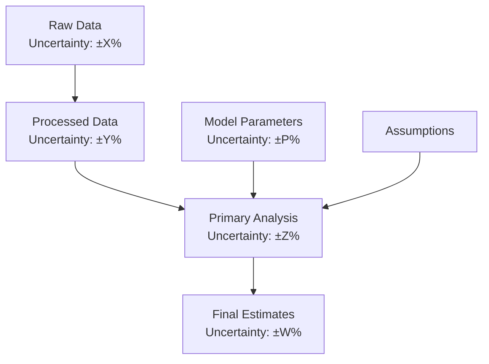

<!--
✒ Metadata
    - Title: Uncertainty Documentation Template (SME Edition - v1.0)
    - File Name: uncertainty_template.md
    - Relative Path: research-stacks/_templates/uncertainty_template.md
    - Artifact Type: docs
    - Version: 1.0.0
    - Date: 2026-01-05
    - Update: Sunday, January 05, 2026
    - Author: Dennis 'dnoice' Smaltz
    - A.I. Acknowledgement: Anthropic - Claude Opus 4.5
    - Signature: ︻デ═─── ✦ ✦ ✦ | Aim Twice, Shoot Once!

✒ Description:
    Template for UNCERTAINTY_DOCUMENTATION.md files providing comprehensive
    documentation of uncertainty sources, quantification methods, and
    sensitivity analyses for each episode's research stack.

✒ Key Features:
    - Feature 1: Systematic uncertainty source identification
    - Feature 2: Quantification methodology documentation
    - Feature 3: Sensitivity analysis results
    - Feature 4: Propagation through analysis pipeline
    - Feature 5: Confidence level assignments
    - Feature 6: Robustness check documentation
    - Feature 7: Known unknowns acknowledgement
    - Feature 8: Recommendations for uncertainty reduction

✒ Usage Instructions:
    Copy to episode methodology/ directory:
        cp _templates/uncertainty_template.md \
           X.X-episode/methodology/UNCERTAINTY_DOCUMENTATION.md

✒ Other Important Information:
    - Dependencies: None (documentation only)
    - Companion to: METHODS_X.X_ORIGINAL_ANALYSIS.md
---------
-->

# Uncertainty Documentation

## Episode {X.X}: {Episode Title}

> **Document Type:** Uncertainty Analysis
>
> **Methods Document:** [METHODS_{X.X}_ORIGINAL_ANALYSIS.md](METHODS_{X.X}_ORIGINAL_ANALYSIS.md)
>
> **Technical Supplement:** [TECHNICAL_SUPPLEMENT_{X.X}_METHODOLOGY.md](TECHNICAL_SUPPLEMENT_{X.X}_METHODOLOGY.md)

---

## Table of Contents

1. [Overview](#1-overview)
2. [Uncertainty Sources](#2-uncertainty-sources)
3. [Quantification Methods](#3-quantification-methods)
4. [Sensitivity Analysis](#4-sensitivity-analysis)
5. [Uncertainty Propagation](#5-uncertainty-propagation)
6. [Robustness Checks](#6-robustness-checks)
7. [Confidence Assessment](#7-confidence-assessment)
8. [Known Unknowns](#8-known-unknowns)
9. [Recommendations](#9-recommendations)

---

## 1. Overview

### 1.1 Purpose

This document provides comprehensive documentation of uncertainty in the analyses presented in Episode {X.X}: {Episode Title}. Transparent uncertainty communication is essential for:

- Honest representation of findings
- Appropriate interpretation of results
- Informed decision-making
- Scientific credibility

### 1.2 Uncertainty Framework

We categorize uncertainty following established frameworks:

| Type | Description | Examples in This Analysis |
| ---- | ----------- | ------------------------- |
| **Aleatory** | Inherent randomness | Natural variation in populations |
| **Epistemic** | Knowledge limitations | Incomplete sampling |
| **Model** | Model structure choices | Functional form assumptions |
| **Scenario** | Future pathways | Projection assumptions |

### 1.3 Summary of Key Uncertainties

| Finding | Point Estimate | Uncertainty Range | Confidence |
| ------- | -------------- | ----------------- | ---------- |
| {Finding 1} | {Value} | [{Low}, {High}] | {High/Medium/Low} |
| {Finding 2} | {Value} | [{Low}, {High}] | {High/Medium/Low} |
| {Finding 3} | {Value} | [{Low}, {High}] | {High/Medium/Low} |

---

## 2. Uncertainty Sources

### 2.1 Data Uncertainty

#### 2.1.1 Measurement Error

| Variable | Error Type | Magnitude | Source | Treatment |
| -------- | ---------- | --------- | ------ | --------- |
| {Variable 1} | {Systematic/Random} | {± X%} | {Where documented} | {How handled} |
| {Variable 2} | {Systematic/Random} | {± X%} | {Where documented} | {How handled} |

#### 2.1.2 Sampling Uncertainty

**Spatial Sampling:**

- Coverage: {Description of geographic coverage}
- Bias: {Known sampling biases}
- Impact: {How this affects results}

**Temporal Sampling:**

- Coverage: {Description of temporal coverage}
- Gaps: {Known data gaps}
- Impact: {How this affects results}

**Taxonomic Sampling:**

- Coverage: {Proportion of species assessed}
- Bias: {Known taxonomic biases - e.g., vertebrate focus}
- Impact: {How this affects results}

#### 2.1.3 Data Quality

| Source | Quality Rating | Basis | Limitations |
| ------ | -------------- | ----- | ----------- |
| {Source 1} | {High/Medium/Low} | {Assessment basis} | {Key limitations} |
| {Source 2} | {High/Medium/Low} | {Assessment basis} | {Key limitations} |

### 2.2 Model Uncertainty

#### 2.2.1 Structural Uncertainty

| Assumption | Alternatives | Impact if Wrong |
| ---------- | ------------ | --------------- |
| {Assumption 1} | {Alternative approaches} | {Potential bias} |
| {Assumption 2} | {Alternative approaches} | {Potential bias} |

#### 2.2.2 Parameter Uncertainty

| Parameter | Estimate | Uncertainty | Source |
| --------- | -------- | ----------- | ------ |
| {Param 1} | {Value} | {± Range} | {How estimated} |
| {Param 2} | {Value} | {± Range} | {How estimated} |

### 2.3 Scenario Uncertainty

{For projections only}

| Scenario Element | Assumptions | Alternatives | Impact |
| ---------------- | ----------- | ------------ | ------ |
| {Element 1} | {Assumption} | {Alternatives} | {Effect on projections} |

---

## 3. Quantification Methods

### 3.1 Statistical Uncertainty

**Confidence Intervals:**

Method: {Bootstrap / Analytical / Bayesian credible intervals}

```math
CI_{95\%} = \hat{\theta} \pm 1.96 \cdot SE(\hat{\theta})
```

**Standard Errors:**

{Description of how standard errors were calculated}

### 3.2 Monte Carlo Simulation

**Configuration:**

- Iterations: {N}
- Random seed: {Seed for reproducibility}
- Distribution assumptions: {What distributions used}

**Results:**

| Metric | Mean | Median | 5th Percentile | 95th Percentile |
| ------ | ---- | ------ | -------------- | --------------- |
| {Metric 1} | {Value} | {Value} | {Value} | {Value} |
| {Metric 2} | {Value} | {Value} | {Value} | {Value} |

### 3.3 Expert Judgment

{If applicable}

| Assessment | Expert Range | Consensus | Confidence |
| ---------- | ------------ | --------- | ---------- |
| {Assessment 1} | [{Low}, {High}] | {Value} | {Level} |

---

## 4. Sensitivity Analysis

### 4.1 One-at-a-Time Sensitivity

| Parameter | Baseline | Test Range | Result Range | Sensitivity |
| --------- | -------- | ---------- | ------------ | ----------- |
| {Param 1} | {Value} | [{Low}, {High}] | [{Result Low}, {Result High}] | {High/Medium/Low} |
| {Param 2} | {Value} | [{Low}, {High}] | [{Result Low}, {Result High}] | {High/Medium/Low} |
| {Param 3} | {Value} | [{Low}, {High}] | [{Result Low}, {Result High}] | {High/Medium/Low} |

### 4.2 Tornado Diagram

**Most Influential Parameters (ranked by impact):**

1. **{Parameter 1}:** {Impact description}
2. **{Parameter 2}:** {Impact description}
3. **{Parameter 3}:** {Impact description}

### 4.3 Global Sensitivity Analysis

{If applicable - e.g., Sobol indices}

| Parameter | First-Order Index | Total-Order Index |
| --------- | ----------------- | ----------------- |
| {Param 1} | {Value} | {Value} |
| {Param 2} | {Value} | {Value} |

### 4.4 Scenario Sensitivity

| Scenario Assumption | Alternative | Impact on Conclusions |
| ------------------- | ----------- | --------------------- |
| {Assumption 1} | {Alternative} | {Does conclusion change?} |
| {Assumption 2} | {Alternative} | {Does conclusion change?} |

---

## 5. Uncertainty Propagation

### 5.1 Propagation Through Analysis Pipeline



### 5.2 Uncertainty at Each Stage

| Stage | Input Uncertainty | Added Uncertainty | Output Uncertainty |
| ----- | ----------------- | ----------------- | ------------------ |
| Data Processing | {± X%} | {± Y%} | {± Z%} |
| Analysis | {± Z%} | {± W%} | {± V%} |
| Interpretation | {± V%} | {Qualitative} | {Final range} |

### 5.3 Dominant Uncertainty Sources

**Ranked by contribution to total uncertainty:**

1. {Source 1}: {X%} of total variance
2. {Source 2}: {Y%} of total variance
3. {Source 3}: {Z%} of total variance

---

## 6. Robustness Checks

### 6.1 Alternative Data Sources

| Alternative | Result | Comparison | Consistent? |
| ----------- | ------ | ---------- | ----------- |
| {Alt Source 1} | {Result} | vs. {Primary result} | {Yes/No} |
| {Alt Source 2} | {Result} | vs. {Primary result} | {Yes/No} |

### 6.2 Alternative Methods

| Alternative Method | Result | Comparison | Consistent? |
| ------------------ | ------ | ---------- | ----------- |
| {Alt Method 1} | {Result} | vs. {Primary result} | {Yes/No} |
| {Alt Method 2} | {Result} | vs. {Primary result} | {Yes/No} |

### 6.3 Subset Analysis

| Subset | N | Result | Consistent with Full? |
| ------ | - | ------ | --------------------- |
| {Subset 1: e.g., Post-2000} | {N} | {Result} | {Yes/No} |
| {Subset 2: e.g., Mammals only} | {N} | {Result} | {Yes/No} |
| {Subset 3: e.g., Tropics only} | {N} | {Result} | {Yes/No} |

### 6.4 Leave-One-Out Analysis

{If applicable - sensitivity to individual data points or studies}

---

## 7. Confidence Assessment

### 7.1 Confidence Level Definitions

| Level | Evidence | Agreement | Description |
| ----- | -------- | --------- | ----------- |
| **Very High** | Robust | High | Multiple independent lines of evidence, strong theoretical basis |
| **High** | Medium-Robust | Medium-High | Good evidence base, well-established methods |
| **Medium** | Limited-Medium | Medium | Some evidence gaps or methodological limitations |
| **Low** | Limited | Low | Significant data gaps or methodological uncertainty |
| **Very Low** | Minimal | Low | Major knowledge gaps, highly uncertain |

### 7.2 Confidence by Finding

| Finding | Evidence Quality | Agreement | Confidence Level | Rationale |
| ------- | ---------------- | --------- | ---------------- | --------- |
| {Finding 1} | {Quality} | {Level} | {Confidence} | {Brief rationale} |
| {Finding 2} | {Quality} | {Level} | {Confidence} | {Brief rationale} |
| {Finding 3} | {Quality} | {Level} | {Confidence} | {Brief rationale} |

### 7.3 Factors Affecting Confidence

**Factors Increasing Confidence:**

- {Factor 1}
- {Factor 2}
- {Factor 3}

**Factors Decreasing Confidence:**

- {Factor 1}
- {Factor 2}
- {Factor 3}

---

## 8. Known Unknowns

### 8.1 Acknowledged Knowledge Gaps

| Gap | Nature | Impact on Analysis | Research Needed |
| --- | ------ | ------------------ | --------------- |
| {Gap 1} | {Data/Method/Theory} | {How it affects results} | {What would help} |
| {Gap 2} | {Data/Method/Theory} | {How it affects results} | {What would help} |
| {Gap 3} | {Data/Method/Theory} | {How it affects results} | {What would help} |

### 8.2 Potential Unknown Unknowns

{Acknowledge that there may be factors not yet recognized that could affect results}

- Potential unrecognized biases in primary data sources
- Emerging phenomena not captured in historical data
- Complex interactions not modeled

### 8.3 What Would Change Conclusions

| If... | Then... | Current Assessment |
| ----- | ------- | ------------------ |
| {Condition 1} | {Consequence for conclusions} | {How likely} |
| {Condition 2} | {Consequence for conclusions} | {How likely} |

---

## 9. Recommendations

### 9.1 For Interpretation

When interpreting results from this analysis:

1. **Consider the full uncertainty range**, not just point estimates
2. **Note the confidence levels** assigned to each finding
3. **Recognize limitations** documented in this analysis
4. **Do not extrapolate** beyond the scope of the data

### 9.2 For Future Research

Priority research to reduce uncertainty:

| Priority | Research Need | Expected Impact |
| -------- | ------------- | --------------- |
| High | {Research 1} | {How it would reduce uncertainty} |
| High | {Research 2} | {How it would reduce uncertainty} |
| Medium | {Research 3} | {How it would reduce uncertainty} |

### 9.3 For Decision-Making

When using these findings for decisions:

- Consider worst-case scenarios within the uncertainty range
- Apply precautionary principle where stakes are high
- Seek additional evidence for high-stakes decisions
- Monitor for new information that could change assessments

---

## Document Metadata

| Field | Value |
| ----- | ----- |
| **Episode** | {X.X} - {Episode Name} |
| **Version** | 1.0.0 |
| **Last Updated** | {YYYY-MM-DD} |

---

> **︻デ═─── ✦ ✦ ✦ | Aim Twice, Shoot Once!**
